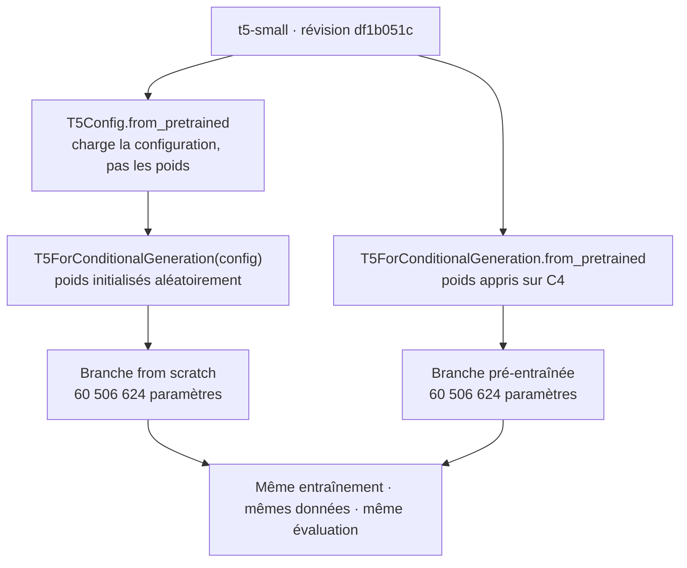
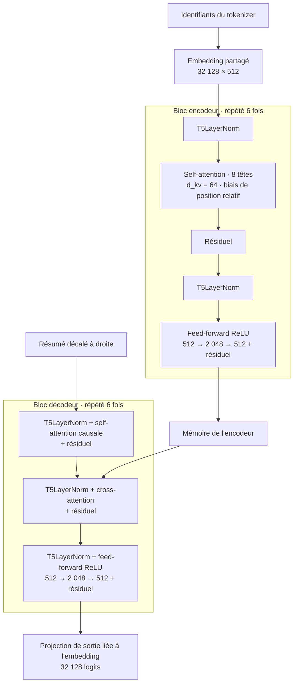

# Présentation

Le projet compare deux instances de **la même architecture `t5-small`** sur la même tâche de résumé, avec le même corpus, le même tokenizer, le même entraînement et le même protocole d'évaluation :

| | from scratch | `t5-small` |
| --- | --- | --- |
| Poids au départ | tirés au hasard | pré-entraînés sur C4 |
| Paramètres | 60 506 624 | 60 506 624 |
| Dimension des vecteurs | 512 | 512 |
| Couches | 6 encodeur, 6 décodeur | 6 encodeur, 6 décodeur |
| Têtes d'attention | 8 | 8 |

Le nombre de paramètres dépend de l'architecture, pas des valeurs contenues dans les poids. Les deux modèles possèdent donc les mêmes matrices, aux mêmes formes ; seule leur valeur initiale change.

### Comment les deux modèles sont construits



`from scratch` ne signifie donc pas que l'architecture T5 est réécrite à la main. Cela signifie que l'architecture officielle est instanciée **sans charger ses poids pré-entraînés**.

### Architecture interne de `t5-small`



| Hyperparamètre architectural | Valeur |
| --- | --- |
| `d_model` | 512 |
| Encodeur / décodeur | 6 blocs / 6 blocs |
| Têtes / dimension par tête | 8 / 64 |
| `d_ff` | 2 048 |
| Position | biais relatif, 32 buckets |
| Normalisation | `T5LayerNorm`, de type RMS sans biais |
| Vocabulaire architectural | 32 128 entrées |
| Embeddings | partagés entre encodeur, décodeur et projection finale |
| Paramètres entraînables | 60 506 624 |


---

## Partie I. Le chemin d'un texte

### 1. Le préfixe de tâche

T5 est multi-tâches : il traduit, répond à des questions, classe, résume. La tâche n'est pas choisie par un drapeau, elle est écrite au début de l'entrée. `summarize:` signifie « résume ce qui suit ».

```text
summarize: Three men have been arrested.
```

Le modèle from scratch reçoit ce préfixe alors qu'il n'a qu'une seule tâche et que rien ne l'y oblige. C'est délibéré : les deux modèles doivent recevoir exactement la même chaîne, sans quoi un écart de score pourrait venir de l'entrée plutôt que des poids.

### 2. Tokenisation

Un modèle ne lit pas du texte, il lit des entiers. Le tokenizer T5 découpe le texte en sous-mots et rend un identifiant par sous-mot.

```text
"summarize: Three men have been arrested."

21603   10    5245    1076   43      118     10195      5     1
summarize  :   Three   men   have   been   arrested    .   </s>
```

Le préfixe compte deux identifiants et non un : `summarize` et `:` sont deux sous-mots distincts. Le `1` final marque la fin de séquence. Le vocabulaire compte 32 100 entrées, et le corpus en fait apparaître 24 480. Un mot rare est découpé en plusieurs morceaux, ce qui permet au vocabulaire de rester fini : il n'y a pas de mot inconnu, seulement des mots plus coûteux.

**Les deux modèles partagent ce tokenizer** : même vocabulaire, même découpage, mêmes identifiants pour une phrase donnée. C'est ce qui rend la comparaison lisible, puisqu'un écart de score ne peut alors venir que des modèles.

L'article est tronqué à 512 tokens et le résumé à 128. La première coupe touche 85 % des articles, la seconde 5,3 % des résumés.

### 3. Embeddings et position relative

Chaque identifiant sert d'index dans une table qui rend un vecteur de 512 dimensions dans les deux modèles. L'architecture réserve 32 128 lignes, même si le tokenizer expose 32 100 identifiants effectivement utilisables.

Ce qu'un vecteur encode n'est pas décidé à la main, c'est l'entraînement qui le fixe, et c'est là que passe la différence entre les deux modèles :

- from scratch : la table est tirée au hasard au premier pas, et tout ce qu'elle finira par encoder devra être appris sur 20 000 articles ;
- `t5-small` : la table arrive déjà ajustée sur C4, un corpus sans commune mesure avec celui-ci.

La même matrice d'embedding est partagée par l'encodeur, le décodeur et la projection finale vers le vocabulaire. Les deux modèles partagent sa forme, mais pas ses valeurs : aléatoires d'un côté, apprises sur C4 de l'autre.

T5 n'ajoute pas d'encodage positionnel absolu aux embeddings. Il ajoute aux scores d'attention un **biais de position relatif**, appris selon la distance entre deux tokens et regroupé dans 32 buckets. L'ordre est donc représenté dans l'attention elle-même.

### 4. Attention multi-têtes

Chaque position projette son vecteur en trois : une requête, une clé, une valeur. Le produit d'une requête par toutes les clés donne un score par position ; le softmax en fait des poids qui somment à 1 ; la sortie est la moyenne des valeurs pondérée par ces poids. C'est ainsi qu'un token « regarde » les autres et décide lesquels comptent.

Huit têtes travaillent en parallèle sur 64 dimensions chacune, puis leurs sorties sont recomposées. Une tête peut se spécialiser (relations locales, accord, reprise d'une entité nommée), mais rien ne le lui assigne : ce qu'une tête capte est un constat a posteriori, pas une consigne.

Formes pour un batch de 8 et un article de `S` tokens, modèle from scratch :

| Étape | Forme |
| --- | --- |
| Embedding | `(8, S, 512)` |
| Découpage en têtes | `(8, 8, S, 64)` |
| Scores d'attention | `(8, 8, S, S)` |
| Contexte recomposé | `(8, S, 512)` |

Le tenseur de scores est le seul dont la taille croît comme le **carré** de la longueur. C'est lui qui met un prix sur la troncature à 512 tokens.

### 5. Encodeur, décodeur, masques

L'encodeur lit l'article en entier, chaque position voyant toutes les autres. Le décodeur écrit le résumé et regarde deux choses : ce qu'il a déjà écrit, et la sortie de l'encodeur, par une attention croisée.

Trois masques encadrent l'opération :

| Masque | Ce qu'il empêche |
| --- | --- |
| Masque de padding | Que l'attention prenne les `<pad>` pour du texte |
| Masque causal | Que le décodeur voie les tokens qu'il doit encore prédire |
| `-100` dans les labels | Que la loss récompense la prédiction du padding |

À l'entraînement, le résumé de référence est fourni d'un coup, décalé d'une position : la position `t` du décodeur contient le token `t - 1` de la cible, donc prédire le token `t` ne demande que ce que le masque causal autorise à voir. Le tokenizer T5 n'a pas de token de début de séquence, c'est donc l'identifiant de padding qui tient ce rôle, exactement comme dans T5.

### 6. Génération

À la génération, rien n'est fourni : le modèle produit un token, se le redonne, et recommence. C'est le régime **auto-régressif**.

Le décodage retenu est un beam search à 4 faisceaux : à chaque pas, les 4 hypothèses les plus probables sont conservées, là où un choix glouton retient le seul token de tête et ne peut plus revenir dessus. La boucle s'arrête sur le token `</s>` ou à 128 tokens, et `no_repeat_ngram_size = 3` interdit de répéter un trigramme déjà écrit.

Les sept expériences décodent avec les mêmes réglages : deux modèles décodés différemment ne se comparent pas.

### 7. Détokenisation

Les identifiants générés repassent par le tokenizer, qui rend du texte lisible. Le résumé est alors comparé à la référence par ROUGE (unigrammes communs, bigrammes communs, plus longue sous-séquence commune), sur les mêmes 1 000 documents de test pour tous les modèles.

### Le chemin complet

```text
texte brut
  ->  préfixe de tâche (summarize:)
  ->  tokenisation (tokenizer T5, 32 100 entrées)
  ->  identifiants, tronqués à 512
  ->  embeddings partagés de 512 dimensions
  ->  encodeur T5 × 6 (attention + biais de position relatif)
  ->  décodeur T5 × 6 (attention causale + attention croisée)
  ->  32 128 logits, liés à la table d'embedding
  ->  beam search, token par token
  ->  détokenisation
  ->  résumé, comparé à la référence par ROUGE
```

---

## Partie II. L'entraînement

Entrée, sortie, perte, mise à jour des poids : la boucle est la même pour les deux modèles, seul le point de départ change.

### La boucle

1. **Une paire par exemple.** En entrée `summarize: <article>`, en sortie attendue les highlights de référence du corpus.
2. **Passe avant.** L'entrée traverse l'encodeur puis le décodeur, qui rend une distribution de probabilité sur les 32 128 entrées de la tête de sortie, à chaque position de la cible. Le résumé de référence étant fourni décalé, toutes les positions sont calculées d'un coup et non l'une après l'autre : c'est ce qui rend un pas d'entraînement bien plus rapide qu'une génération.
3. **Perte.** Cross-entropy entre la distribution prédite et le token de référence :

   ```text
   Loss = - somme sur t de log p(token de référence à la position t)
   ```

   Les positions à `-100`, c'est-à-dire le padding, sont ignorées. La moyenne est pondérée par les tokens et non par les batchs : un batch de résumés courts ne doit pas peser autant qu'un batch de résumés longs.
4. **Rétropropagation.** Le gradient de la perte est calculé pour chaque poids : dans quelle direction le déplacer, et de combien.
5. **Mise à jour.** AdamW applique le pas, après écrêtage de la norme globale des gradients à 1,0 :

   ```text
   theta  <-  theta - eta * gradient(Loss, theta)
   ```

   AdamW garde deux moyennes mobiles par poids et applique la régularisation directement sur les poids, aux seules matrices, jamais aux biais ni aux gains de normalisation. Sans l'écrêtage, un Transformer entraîné de zéro diverge sur ses premières centaines de pas.
6. **Fin d'époque.** Une passe de validation calcule la même perte sur le split de validation, décide si le checkpoint est le meilleur vu jusqu'ici et alimente l'arrêt anticipé. Les poids évalués à la fin sont relus depuis ce meilleur checkpoint, pas depuis le dernier.

Deux réglages méritent un mot. Le **lissage de labels** retire 10 % de la masse au token de référence et l'étale sur le vocabulaire : le modèle est pénalisé s'il devient trop confiant, ce qui limite le surapprentissage sur un petit corpus. Le **taux d'apprentissage** n'est pas constant : il monte de zéro à son maximum sur les 6 % premiers pas, puis décroît linéairement. La montée évite qu'un premier pas mal orienté abîme des poids encore aléatoires, la descente laisse la fin de l'entraînement affiner plutôt que sauter.

### Ce qui sépare les deux entraînements

| | `scratch_100` | `pretrained_ft_100` |
| --- | --- | --- |
| Poids initiaux | tirés au hasard | `t5-small`, révision `df1b051c` |
| Architecture | `t5-small`, révision `df1b051c` | `t5-small`, révision `df1b051c` |
| Paramètres | 60 506 624 | 60 506 624 |
| Époques | 3 | 3 |
| Taux d'apprentissage | 1e-4 | 1e-4 |
| Patience d'arrêt anticipé | 2 | 2 |
| Batch | 8, accumulé 4 fois | 8, accumulé 4 fois |
| Corpus, tokenizer, optimiseur, décodage, métrique | identiques | identiques |

Le tableau est volontairement identique partout sauf sur la première ligne. Cela transforme la provenance des poids initiaux en **seule variable expérimentale**.

Le zero-shot, lui, ne s'entraîne pas du tout : ses poids ne bougent pas. Il saute l'étape d'entraînement, pas le reste de la chaîne.

---

## Partie III. Ce que le pré-entraînement change

> **Moitié de campagne.** Les quatre runs pré-entraînés sont mesurés. Les trois runs from scratch sont déclarés et n'ont pas encore tourné : leurs lignes restent vides plutôt que d'être remplies par autre chose.

| Modèle | Corpus | ROUGE-L | IC 95 % | Statut |
| --- | --- | --- | --- | --- |
| `t5-small` fine-tuné | 100 % | **0,2914** | [0,2838, 0,2994] | `OK` |
| `t5-small` fine-tuné | 50 % | 0,2896 | [0,2818, 0,2975] | `OK` |
| `t5-small` fine-tuné | 10 % | 0,2861 | [0,2777, 0,2939] | `OK` |
| `t5-small` zero-shot | sans objet | 0,2751 | [0,2672, 0,2829] | `OK` |
| `t5-small` from scratch | 100 % | | | `NOT_RUN` |
| `t5-small` from scratch | 50 % | | | `NOT_RUN` |
| `t5-small` from scratch | 10 % | | | `NOT_RUN` |

Ce que ces quatre lignes disent déjà : le fine-tunage sur ce corpus rapporte 0,016 de ROUGE-L au modèle pré-entraîné, et multiplier le corpus par dix lui en rapporte 0,005. Ce que la moitié manquante dira : combien vaut le fait de partir de poids appris plutôt que d'un tirage.

### Livrable 1. Performance contre taille du corpus d'entraînement

La figure est produite par `make figures` à partir des enregistrements de runs, et porte en note les expériences sans mesure reportable. Elle ne trace donc aujourd'hui que la famille pré-entraînée.

Les sous-ensembles restent emboîtés : 10 % est un préfixe de 50 %, lui-même préfixe de 100 %. Pour chaque proportion, les deux T5 reçoivent les mêmes exemples et les mêmes réglages.

Le « 100 % » désigne ici les 20 000 exemples du corpus de travail, jamais CNN/DailyMail au complet, qui en compte 287 113.

### Livrable 2. À partir de quelle taille le from scratch devient-il compétitif ?

La question demande une pente, donc au moins deux points du côté from scratch. Il n'y en a aucun pour l'instant, et une extrapolation posée sur zéro point serait une illustration, pas une réponse. L'ordre de grandeur de l'écart à combler, lui, est mesuré : à 100 % du corpus le modèle voit environ 3 400 fois moins de texte que `t5-small` n'en a vu en pré-entraînement, et CNN/DailyMail au complet ne ramènerait ce facteur qu'à 240.

### Variantes du fine-tuning

- **Full fine-tuning**, ce que fait ce projet : tous les poids bougent. Sur 60,5 M de paramètres, cela tient sur une carte de 8 Gio.
- **PEFT et LoRA** : les poids d'origine sont gelés, seules de petites matrices de rang faible insérées à côté sont entraînées. Moins de mémoire d'optimiseur, et un adaptateur de quelques mégaoctets par tâche au lieu d'une copie complète du modèle. Hors périmètre ici : à cette taille de modèle, le full fine-tuning ne pose pas le problème que LoRA résout.

---

## Partie IV. Ce qui garantit le protocole

Les contrôles importants portent maintenant sur l'identité des deux architectures et des deux entraînements, avant même de regarder une courbe.

| Répertoire | Fichiers | Portée |
| --- | --- | --- |
| `tests/unit/` | 44 | Un composant à la fois, hors ligne, en une fraction de seconde |
| `tests/integration/` | 8 | Deux composants qui tiennent ensemble, du fichier de configuration à la ligne de résultat |

`make test` lance les deux, `make coverage` y ajoute le seuil de 80 % de couverture de `src`. Quatre marqueurs sont déclarés (`unit`, `integration`, `slow`, `gpu`) et `--strict-markers` refuse tout marqueur non déclaré : une faute de frappe ne peut pas faire disparaître un test en silence.

### Les contrôles propres à la comparaison T5

| Contrôle | Garantie |
| --- | --- |
| Même `T5Config` épinglée | mêmes couches, dimensions, normalisations et biais relatifs |
| Même classe `T5ForConditionalGeneration` | même graphe de calcul |
| Mêmes clés et formes du `state_dict` | mêmes matrices, au même endroit |
| Même nombre de paramètres | 60 506 624 dans les deux branches |
| Configurations `scratch_*` comparées aux `pretrained_ft_*` | mêmes données, entraînement et évaluation pour chaque proportion |
| Champ `initialization` enregistré | impossible de confondre poids aléatoires et pré-entraînés dans un run |

### Ce que les autres tests épinglent

| Objet du test | Ce qu'il attrape |
| --- | --- |
| Retrait du token de départ à la génération | Un décalage d'une position entre prédiction et référence |
| Budget `max_new_tokens` respecté, faisceau compris | Un décodage plus long d'un côté que de l'autre |
| Absence de gradient et retour en mode évaluation après génération | Un dropout resté actif, donc un score non reproductible |
| Le lissage de labels remplace bien la perte du modèle, et ignore le padding | Un lissage appliqué aux positions à `-100` |
| Fine-tunage à travers le trainer partagé | Deux boucles d'entraînement divergentes entre les branches |
| Précision pleine et rappel partiel sur une prédiction courte | L'ordre des arguments de ROUGE, que la F-mesure seule ne distingue pas |
| Étanchéité des splits | Un document du test qui réapparaît dans l'entraînement, ce qui fabriquerait tous les scores |
| `test_requirements.py` | Une divergence entre `pyproject.toml` et les trois `requirements*.txt` |
| `test_notebooks.py` | Un kernel de carnet réassigné par l'éditeur |

Un repère complète ces tests, hors suite : le carnet 03 mesure la perte du modèle non entraîné sur un vrai lot, environ 10,85 contre `ln(32 128) = 10,38` attendus pour une distribution uniforme. Franchement en dessous signalerait une fuite, franchement au-dessus un masque cassé.

### Les huit tests d'intégration

| Test | Le maillon couvert |
| --- | --- |
| `test_data_pipeline` | Nettoyage, tirage, validation, empreintes, manifeste, statistiques |
| `test_tokenizer` | Le vrai tokenizer T5 : corpus vers tokenizer, tokenizer vers entrée du modèle |
| `test_training_pipeline` | Dataset vers tokenizer, tokenizer vers modèle, modèle vers perte, perte vers checkpoint |
| `test_evaluation_pipeline` | Modèle vers génération, génération vers métrique |
| `test_experiment_pipeline` | Un fichier de configuration entre, une ligne de `reports/results/` sort |
| `test_reproduce_chain` | Les cinq étapes de `make reproduce` en mode quick, jusqu'au markdown injecté |
| `test_tracking_pipeline` | Qu'un vrai MLflow accepte une charge utile qu'un faux tracker avalerait |
| `test_pretrained_baseline` | Que les poids téléchargés portent une vraie connaissance et que le tokenizer est littéralement partagé |

**Aucun de ces tests ne produit un score.** Les corpus y sont synthétiques ou faits de quelques phrases écrites à la main, et les modèles assez petits pour s'entraîner à l'intérieur d'un test. Un chiffre mesuré là ne dirait rien de CNN/DailyMail, et les assertions le disent : la chaîne `reproduce` en mode quick doit rendre des enregistrements `PARTIAL` dont toutes les colonnes de score restent vides. Ce qui est vérifié est que la chaîne tient, pas qu'elle apprend.

Les tests qui chargent les vrais poids `t5-small` portent le marqueur `slow` : ils demandent le cache Hugging Face et peuvent être écartés du cycle rapide par `-m "not slow"`.

---

## Conclusion

Le protocole contrôle maintenant la question posée : les deux branches partagent la classe `T5ForConditionalGeneration`, la révision, les 60 506 624 paramètres, les données et tous les hyperparamètres. **La seule différence est l'initialisation des poids.**

La conclusion expérimentale reste ouverte jusqu'à la mesure des trois runs from scratch. Ce dépôt mesure pour l'instant l'effet du fine-tunage sur un modèle pré-entraîné, et une seule commande manque pour mesurer l'effet du pré-entraînement lui-même : `python -m src.experiments.run --all`.

Après la nouvelle campagne, la comparaison pourra attribuer l'écart observé au pré-entraînement, sous deux réserves : une seule graine d'entraînement et une troncature à 512 tokens qui retire environ la moitié du texte source.

---

## Pour aller voir

| Où | Quoi |
| --- | --- |
| [src/models/pretrained/t5.py](src/models/pretrained/t5.py) | Les deux constructions : poids aléatoires et poids pré-entraînés |
| [notebooks/03_transformer_walkthrough.ipynb](notebooks/03_transformer_walkthrough.ipynb) | Le T5 initialisé aléatoirement traversé par un vrai batch, forme par forme |
| [GUIDE.md](GUIDE.md) | Le fichier qui fait chaque étape, du corpus à MLflow |
| [RAPPORT.md](RAPPORT.md) | Les résultats, les ablations et les limites |
