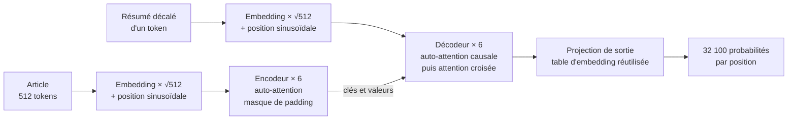

# Groupe 8 · Traduction/résumé automatique : entraînement vs modèle pré-entraîné

## 1. La question du projet

Pour produire un résumé, un modèle doit à la fois comprendre la langue et apprendre la tâche de résumé automatique. Deux stratégies sont possibles :

- **entraîner from scratch** : partir de poids aléatoires et tout apprendre sur le corpus du projet ;
- **utiliser un modèle pré-entraîné** : partir de connaissances linguistiques déjà acquises, puis adapter le modèle à la tâche.

Notre question centrale est donc :

> Avec un corpus limité, quel est l'apport réel du pré-entraînement, et davantage de données permettent-elles au Transformer from scratch de rattraper `t5-small` ?

Pour y répondre, nous avons implémenté un Transformer encodeur-décodeur bloc par bloc, puis comparé trois familles de modèles sur **2 000, 10 000 et 20 000 exemples** de CNN/DailyMail.

### Hypothèses de travail

1. Le T5 pré-entraîné devrait être meilleur avec peu de données.
2. Les modèles initialisés aléatoirement devraient davantage profiter d'un corpus plus grand.
3. Augmenter la profondeur du Transformer devrait aider, mais moins que le pré-entraînement.

Ces hypothèses opposent deux stratégies, mais deux modèles ne suffisent pas à les départager.

## 2. Pourquoi avons-nous comparé trois modèles ?

| Modèle | Point de départ | Rôle dans l'expérience | Paramètres |
| --- | --- | --- | ---: |
| Transformer from scratch | Poids aléatoires, architecture écrite à la main | Livrable principal | 60 575 744 |
| `t5-small` aléatoire | Poids aléatoires, architecture T5 | Groupe témoin | 60 506 624 |
| `t5-small` pré-entraîné | Poids appris auparavant sur C4 | Modèle de référence | 60 506 624 |

C4 est un vaste corpus de pages web nettoyées. T5 y a appris des régularités de la langue avant d'être adapté à notre tâche de résumé.

Le Transformer from scratch et T5 ont un **budget paramétrique presque identique** : leur nombre de paramètres ne diffère que de **0,11 %**. Cela rend la comparaison raisonnable, sans rendre leurs architectures identiques.

Le T5 aléatoire est le contrôle essentiel de l'expérience :

- **Transformer from scratch vs T5 pré-entraîné** compare les deux solutions complètes ; l'écart inclut le pré-entraînement et les différences d'architecture ;
- **T5 aléatoire vs T5 pré-entraîné** conserve exactement la même architecture ; ce contraste isole donc l'effet des poids pré-entraînés dans notre protocole.

> Sans le T5 aléatoire, un meilleur score de T5 ne pourrait pas être attribué clairement au pré-entraînement.

## 3. Un protocole commun

| Élément | Choix |
| --- | --- |
| Corpus | CNN/DailyMail 3.0.0 |
| Corpus de travail | 20 000 entraînement, 1 000 validation, 1 000 test |
| Sous-ensembles | 10 % = 2 000, 50 % = 10 000, 100 % = 20 000 |
| Tokenisation | Tokenizer `t5-small` partagé par les trois familles |
| Longueurs maximales | 512 tokens en entrée, 128 en sortie |
| Entraînement | 3 époques, AdamW, taux d'apprentissage `1e-4` |
| Taille de batch effective | 32 : batch de 8, gradients accumulés sur 4 pas |
| Génération | Décodage par faisceaux : 4 hypothèses concurrentes |
| Reproductibilité | Graine 42 |

Les sous-ensembles sont **emboîtés** : les 2 000 exemples sont inclus dans les 10 000, eux-mêmes inclus dans les 20 000. Ainsi, augmenter la taille du corpus ajoute des exemples sans remplacer ceux déjà utilisés.

Tous les modèles sont finalement évalués sur les **mêmes 1 000 articles de test**, avec les mêmes réglages de génération et les mêmes métriques.

Une nuance importante : avec trois époques fixes, un corpus plus grand produit aussi davantage de mises à jour des poids. L'ablation mesure donc l'effet d'un corpus plus riche **dans ce budget d'entraînement**, et non l'effet de l'information indépendamment du temps de calcul.

## 4. Le Transformer implémenté



L'auto-attention, par nature, ne tient pas compte de l'ordre des mots : sans signal de position, le modèle ne percevrait qu'un sac de mots. L'encodage sinusoïdal ajoute cette information directement aux embeddings, sans nécessiter de paramètres supplémentaires.

| Hyperparamètre | Valeur |
| --- | ---: |
| Dimension du modèle | 512 |
| Têtes d'attention | 8 |
| Couches encodeur / décodeur | 6 / 6 |
| Dimension du réseau feed-forward | 2 048 |

Chaque couche combine cinq mécanismes :

- **Attention multi-têtes** : chaque mot regarde tous les autres pour comprendre leurs relations. Plusieurs têtes d'attention permettent de capter différents aspects du contexte.
- **Masques de contrôle** : le masque de padding empêche le modèle de tenir compte des zones de remplissage ; le masque causal interdit au décodeur de voir les mots qu'il n'a pas encore générés.
- **Pré-normalisation** : avant chaque sous-couche, une normalisation stabilise l'apprentissage et garde un chemin résiduel clair.
- **Réseau feed-forward** : chaque mot est temporairement projeté dans un espace plus grand pour enrichir sa représentation, puis ramené à sa taille initiale.
- **Table d'embedding partagée** : la même table sert pour l'entrée et la sortie, ce qui réduit le nombre de paramètres et assure une cohérence entre les représentations des mots lus et produits.

Le décodeur utilise aussi une **attention croisée** : pendant qu'il produit le résumé, il consulte les représentations de l'article calculées par l'encodeur.

À l'entraînement, le résumé attendu est décalé d'un token : le modèle apprend à prédire le mot suivant avec une perte de cross-entropy. Le masque causal garantit qu'il ne peut pas copier un mot futur.

À la génération, la référence n'est plus fournie. Le modèle produit un token, le réutilise comme entrée, puis recommence : c'est une génération **auto-régressive**. Le décodage conserve quatre hypothèses concurrentes pour éviter de s'engager immédiatement sur un mauvais premier choix.

Notre architecture et T5 ne sont pas strictement identiques. Les deux normalisent avant chaque sous-couche, mais T5 emploie une normalisation RMS sans aucun biais, et sa notion de position entre au niveau des scores d'attention sous forme d'une table apprise de 32 seaux de distance relative, là où notre encodage sinusoïdal ne coûte rien. Le nombre de paramètres contrôle donc le budget du modèle, pas l'identité de son fonctionnement interne.

## 5. Comment la qualité est-elle mesurée ?

ROUGE compare le résumé produit au résumé de référence. Le score varie de 0 à 1 : plus il est élevé, plus le recouvrement textuel est important.

| Métrique | Comparaison | Lecture simple |
| --- | --- | --- |
| ROUGE-1 | Mots communs | Le contenu principal est-il retrouvé ? |
| ROUGE-2 | Paires de mots consécutifs communes | Les expressions locales sont-elles reproduites ? |
| ROUGE-L | Plus longue sous-séquence commune | Une partie importante est-elle reprise dans le même ordre ? |

Nous rapportons la **F-mesure**, qui équilibre :

- la précision : quelle part du résumé produit se trouve dans la référence ;
- le rappel : quelle part de la référence est retrouvée dans le résumé produit.

La métrique principale est **ROUGE-L**. Chaque score est accompagné d'un intervalle de confiance à 95 %, estimé par bootstrap (c'est-à-dire par rééchantillonnage) sur les 1 000 exemples de test.

ROUGE ne mesure toutefois ni la véracité, ni la fluidité, ni la qualité sémantique complète. De plus, nous utilisons ROUGE-L et non ROUGE-Lsum : nos scores doivent donc être comparés **entre nos modèles**, pas directement aux scores publiés sur CNN/DailyMail.

## 6. Campagne expérimentale

Les **douze expériences** ont terminé avec le statut `OK` :

- 9 expériences pour l'ablation sur la taille du corpus : 3 modèles × 3 tailles ;
- 1 expérience T5 zero-shot, c'est-à-dire sans adaptation à CNN/DailyMail ;
- 2 profondeurs supplémentaires pour le Transformer from scratch.

Le Transformer 6 + 6 est réutilisé dans les deux ablations. La campagne cumule **151 minutes de calcul** sur une RTX 5060 Laptop. Ce temps couvre nos entraînements et nos évaluations, pas le pré-entraînement initial de T5 sur C4.

### Résultat principal : ROUGE-L

| Modèle | 2 000 exemples | 10 000 exemples | 20 000 exemples |
| --- | ---: | ---: | ---: |
| Transformer from scratch | 0,0343 | 0,1014 | 0,1156 |
| `t5-small` aléatoire | 0,0771 | 0,0985 | 0,1172 |
| `t5-small` pré-entraîné | **0,2867** | **0,2894** | **0,2915** |

Le T5 pré-entraîné atteint aussi **0,2751 en zero-shot**, avant tout entraînement sur le corpus du projet.


## 7. Ce que montrent les résultats

### 7.1 Le résultat demandé

À 20 000 exemples :

```text
Transformer from scratch   0,1156
T5 pré-entraîné            0,2915
Écart                      0,1759
```

Le T5 pré-entraîné reste donc nettement devant. Cet écart compare les deux solutions complètes : il combine le pré-entraînement et les différences internes d'architecture.

### 7.2 L'effet du pré-entraînement

Pour isoler cet effet, nous comparons les deux T5 à 20 000 exemples :

```text
T5 aléatoire       0,1172
T5 pré-entraîné    0,2915
Écart              0,1744
```

Puisque l'architecture, les données et le protocole sont identiques, ce contraste mesure l'effet des poids pré-entraînés dans les conditions de l'expérience.

À 20 000 exemples, le T5 aléatoire et le Transformer from scratch obtiennent des scores très proches, avec des intervalles de confiance qui se recouvrent. Nous ne détectons donc pas d'avantage clair de l'une de ces deux architectures lorsqu'elles partent toutes les deux de poids aléatoires.

### 7.3 L'effet de la quantité de données

Entre 2 000 et 20 000 exemples :

| Modèle | Gain observé de ROUGE-L |
| --- | ---: |
| Transformer from scratch | **+0,0813** |
| `t5-small` aléatoire | **+0,0401** |
| `t5-small` pré-entraîné | **+0,0049** |

Les modèles sans pré-entraînement profitent davantage des nouvelles données. Cette dynamique est cohérente avec le fait qu'ils doivent apprendre simultanément la langue et la tâche. Le T5 pré-entraîné commence beaucoup plus haut et sa courbe est presque plate.

Ses intervalles de confiance se recouvrent fortement entre 2 000, 10 000 et 20 000 exemples. La faible hausse observée ne suffit donc pas à établir un gain statistiquement net entre ces trois tailles.

> Le pré-entraînement apporte ici un bon point de départ ; les données supplémentaires apportent surtout aux modèles qui doivent encore tout apprendre.

## 8. La profondeur suffit-elle à compenser ?

| Couches encodeur + décodeur | Paramètres | ROUGE-L |
| --- | ---: | ---: |
| 2 + 2 | 31,2 M | 0,1067 |
| 4 + 4 | 45,9 M | 0,1095 |
| 6 + 6 | 60,6 M | **0,1156** |

Avec la graine testée, le score observé augmente avec la profondeur, même si les intervalles de 2 + 2 et de 4 + 4 se recouvrent. Le gain entre 2 + 2 et 6 + 6 reste d'environ **0,0090**, très loin de l'écart de **0,1744** associé au pré-entraînement dans T5.

La profondeur semble donc aider le Transformer from scratch, mais elle ne remplace pas les connaissances acquises pendant un pré-entraînement massif. Avec une seule graine, cette tendance reste toutefois indicative et non une loi générale.

## 9. Quand le from scratch deviendrait-il compétitif ?

Sur la plage mesurée, nous pouvons répondre avec certitude : **il ne l'est pas encore**.

L'écart avec T5 pré-entraîné passe de **0,2524** à 2 000 exemples à **0,1759** à 20 000 exemples. Il se réduit donc, mais trois points sur une seule décade ne permettent pas d'estimer de manière fiable un point de croisement.

Une extrapolation log-linéaire purement illustrative donnerait environ **quatre millions d'exemples**. Ce nombre n'est pas une prévision : il suppose une progression constante alors que la pente ralentit déjà dans nos mesures.

Le split d'entraînement complet de CNN/DailyMail contient 287 113 exemples, soit environ 14 fois notre corpus actuel, et non les 200 fois suggérées par cet ordre de grandeur. Nous retenons donc :

> Le Transformer from scratch progresse plus vite, mais notre expérience ne permet ni d'observer ni de prédire solidement son croisement avec T5 pré-entraîné.

## 10. Limites et validité des conclusions

| Limite | Conséquence |
| --- | --- |
| Une seule graine, 42 | La variabilité entre entraînements n'est pas mesurée |
| Trois époques pour tous | Protocole identique, mais probablement insuffisant pour les modèles partis de zéro |
| Plus de données = plus de pas d'optimisation | L'effet des exemples n'est pas totalement séparé de l'effet du calcul supplémentaire |
| Entrées limitées à 512 tokens | 85,3 % des articles d'entraînement sont tronqués et environ la moitié du texte reste hors de l'encodeur |
| 20 000 exemples sur 287 113 disponibles | Les conclusions portent uniquement sur la plage observée |
| ROUGE-L seul comme mesure principale | Le recouvrement lexical ne garantit ni véracité ni qualité sémantique |
| Coût du pré-entraînement non compté | La comparaison porte sur la performance finale, pas sur le coût total historique des modèles |

Ces limites délimitent le domaine de validité des conclusions : **un petit corpus, trois époques et un budget matériel limité**.

## 11. Conclusion

Sur les 20 000 exemples du corpus de travail, le T5 pré-entraîné atteint **0,2915** contre **0,1156** pour le Transformer from scratch. Les trois hypothèses posées en section 1 sont confirmées.

| Hypothèse de départ | Verdict | Ce qui la vérifie |
| --- | --- | --- |
| 1. Le pré-entraîné est meilleur avec peu de données | confirmée, nettement | sur 2 000 exemples, 0,2867 contre 0,0771 pour le T5 aléatoire et 0,0343 pour le Transformer from scratch |
| 2. Les modèles partis de zéro profitent davantage d'un corpus plus grand | confirmée | de 2 000 à 20 000 exemples, +0,0813 et +0,0401 contre +0,0049 pour le pré-entraîné |
| 3. La profondeur aide, mais moins que le pré-entraînement | confirmée, sur une seule graine | +0,0090 de 2 + 2 à 6 + 6 couches, contre 0,1744 pour le pré-entraînement |

Le contrôle avec deux T5 identiques indique surtout que, dans notre protocole, le facteur déterminant n'est pas seulement le nombre de paramètres : c'est l'information déjà contenue dans leurs poids.

> **Message à retenir :** avec peu de données et peu d'époques, partir d'un modèle pré-entraîné permet d'atteindre une bien meilleure performance sur la tâche que de réapprendre la langue depuis zéro.

### Pour aller plus loin

- répéter les entraînements avec plusieurs graines ;
- donner davantage d'époques aux modèles initialisés aléatoirement ;
- tester le split d'entraînement complet de CNN/DailyMail ;
- augmenter la longueur d'entrée si le budget mémoire le permet ;
- compléter ROUGE par une évaluation sémantique et humaine.

## Ressources du projet

- [RAPPORT.md](RAPPORT.md) : protocole, intervalles de confiance et discussion complète ;
- [GUIDE.md](GUIDE.md) : fonctionnement du code et chemin des tenseurs ;
- [src/models/scratch/](src/models/scratch/) : implémentation du Transformer.
