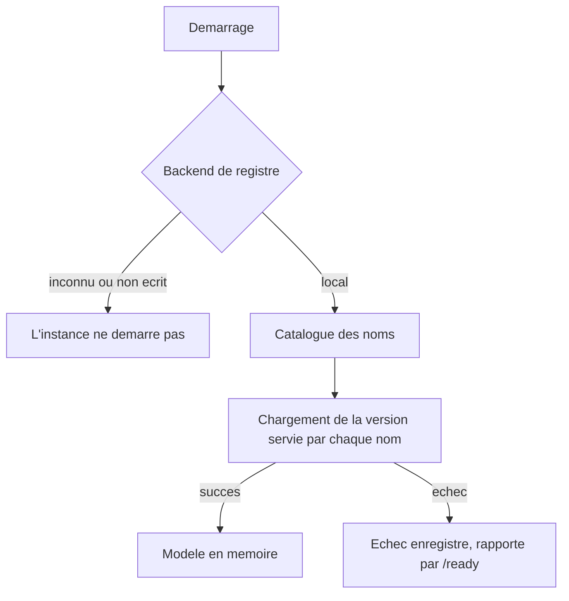

# API

Sections 21 à 27 du cahier des charges. Le backend expose un contrat stable pour qu'un frontend puisse être écrit séparément, sans lire le code Python.

## Le contrat

| Route | Effet |
| --- | --- |
| `GET /api/v1/health` | Le processus répond |
| `GET /api/v1/ready` | Au moins un modèle est chargé |
| `GET /api/v1/models` | Version servie par chaque nom, cibles des alias |
| `GET /api/v1/models/{name}` | Historique des versions d'un nom |
| `POST /api/v1/predict` | Résume un document |
| `POST /api/v1/compare` | Compare plusieurs modèles sur le même document |

Le préfixe vient de `SYNTRA_API_V1_PREFIX`. Aucune route ne le porte en dur, donc un déploiement derrière une passerelle peut le déplacer sans toucher au code.

La spécification complète est versionnée dans [`docs/api/openapi.json`](openapi.json), régénérée par `make docs-sync` et comparée au code par `scripts/check_docs_sync.py`. Une route ajoutée sans régénération fait échouer le pipeline plutôt que de surprendre un client.

Le bloc `servers` porte l'origine de l'instance, lue dans `SYNTRA_PUBLIC_BASE_URL`. C'est le seul morceau du contrat qui diffère réellement entre un poste de développement et un déploiement, et sans lui un outil construit à partir du document importe six chemins auxquels il ne sait rien envoyer.

`info.version` vaut `1.0.0` et décrit le contrat, pas le paquet. Un changement cassant sur un schéma l'incrémente ; une version qui ne change que l'implémentation ne le fait pas.

## Essayer l'API depuis Postman

```bash
make api        # 127.0.0.1:8000, rechargement automatique
```

Deux fichiers à importer, dans cet ordre :

| Fichier | Ce qu'il apporte |
| --- | --- |
| [`docs/api/openapi.json`](openapi.json) | La collection : six requêtes, leurs schémas et leurs exemples |
| [`docs/api/syntra.postman_environment.json`](syntra.postman_environment.json) | L'environnement : `baseUrl` et `apiPrefix` |

Postman lit le bloc `servers` à l'import et adresse chaque requête à `{{baseUrl}}`. Sans l'environnement, cette variable reste vide et tout part sur une URL relative ; il faut donc le sélectionner dans le menu en haut à droite après l'import.

Les deux fichiers sortent du même `make docs-sync`, à partir du même réglage. C'est ce qui les empêche de se contredire, et `scripts/check_docs_sync.py` échoue si l'un des deux a divergé du code.

`/predict` et `/compare` portent des corps d'exemple prêts à envoyer, sélectionnables dans Postman sous *Body → Examples*. Un corps déduit du seul schéma remplirait `text` avec le mot `string` : c'est une charge utile valide, qui résume donc quelque chose, mais qui n'apprend rien.

Le port 8000 est aussi celui de `mkdocs serve`. Les deux ne peuvent pas tourner ensemble ; pour en changer, il faut régler `SYNTRA_PUBLIC_BASE_URL` et relancer `make docs-sync`, sinon l'environnement Postman continue de désigner un port que l'application n'écoute plus.

## Désigner un modèle

Trois façons de nommer ce qui doit répondre, par ordre de précision croissante :

```json
{"text": "..."}                                  → l'alias champion
{"text": "...", "model": "scratch"}              → la version que ce nom sert
{"text": "...", "model": "scratch", "version": "v2"}  → cette version exacte
```

`champion` et `challenger` sont des alias de déploiement, pas des noms : ils désignent une version exacte, choisie par une promotion. La réponse nomme toujours la version qui a répondu, jamais seulement le nom demandé, parce que c'est la seule information qui permet de retrouver le run et le score derrière un résumé.

Une requête sans nom sur un registre où rien n'est promu répond 404. C'est l'état réel d'un déploiement où personne n'a désigné de champion, et le déduire en servant « la plus récente » échangerait le modèle derrière une API en marche.

## Décodage

Le décodage tire ses tokens au sort par défaut : deux requêtes identiques rendent deux résumés différents. L'évaluation de la section 10, elle, ne tire jamais. Elle mesure en décodage déterministe avec quatre faisceaux, et une recherche par faisceaux coûte à peu près sa largeur en temps.

| Réglage | Défaut de l'API | Valeur de l'évaluation |
| --- | --- | --- |
| `do_sample` | `true` | `false` |
| `temperature` | 0.9 | sans objet |
| `top_k` | 50 | sans objet |
| `top_p` | 0.95 | sans objet |
| `seed` | tirée par l'instance | sans objet |
| `num_beams` | 1 | 4 |
| `max_new_tokens` | `SYNTRA_MAX_SUMMARY_TOKENS` | 64 |
| `no_repeat_ngram_size` | 3 | 3 |

**Un résumé rendu avec les valeurs par défaut n'est pas la configuration sous laquelle le ROUGE publié a été mesuré.** `{"do_sample": false, "num_beams": 4}` l'est exactement : le reste du décodage est fixé aux valeurs de l'évaluation, ce qui rend la reproduction possible en deux champs.

### La graine

Échantillonner coûte normalement la reproductibilité. Elle est rachetée par la graine : une requête qui n'en porte pas s'en voit attribuer une, tirée par l'instance, et le bloc `decoding` de la réponse la contient. Renvoyer le même corps avec cette graine redonne exactement le même résumé.

```json
{"summary": "...", "decoding": {"do_sample": true, "temperature": 0.9, "seed": 1834771290, ...}}
```

Aucune réponse de cette API n'est donc irreproductible, y compris tirée au sort. C'est ce qui permet de citer un résumé dans un rapport sans avoir à le copier : la graine suffit à le régénérer.

Sur un décodage déterministe, les cinq champs d'échantillonnage valent `null`. Une réponse ne rapporte pas une température qui n'a rien fait.

### Tirage et faisceaux sont exclusifs

`do_sample: true` avec `num_beams` supérieur à un est refusé en 422. Marier les deux demande de noter des faisceaux sur des tirages, ce qui est une troisième stratégie de décodage, et le Transformer from scratch n'en implémente que deux. Le refus est explicite plutôt que silencieux : accepter la requête en ignorant l'une des deux moitiés laisserait croire à un décodage qui n'a pas eu lieu.

**Une comparaison échantillonnée compare deux tirages, pas deux modèles.** Les modèles de `/compare` partagent une graine unique, mais un écart de ROUGE mesuré sous tirage ne dit rien de fiable. Pour lire un écart, envoyer `do_sample: false`.

Le budget est plafonné par ce que les poids savent produire, lu dans le bloc tokenizer publié avec eux. Un modèle entraîné à produire 64 tokens et sollicité pour 200 génère hors de la distribution qu'il a vue, et un Transformer from scratch dépasse son encodage positionnel et lève. La requête est donc rabotée plutôt que refusée, et le bloc `decoding` de la réponse porte la valeur réellement appliquée, pas celle demandée.

Une comparaison tourne sous le plus petit budget de ses modèles. La section 2.1 compare à conditions identiques ; deux budgets seraient deux conditions.

## Comparer

`/compare` exécute plusieurs modèles sur un document, l'un après l'autre, avec le même décodage. Ils partagent un périphérique : les faire tourner en parallèle allongerait les deux latences et rendrait leur comparaison muette, ce qui est précisément ce que l'endpoint mesure.

Le bloc `rouge` n'apparaît que si la requête porte une `reference`. Sans référence il n'y a rien à mesurer, et renvoyer des zéros serait un résultat inventé au sens de la section 44. Le champ `scored` le dit explicitement, pour qu'un client ne lise jamais une absence comme un score nul.

## Erreurs

Toute erreur sort sous la même enveloppe, quelle que soit son origine :

```json
{
  "error": {
    "code": "MODEL_NOT_FOUND",
    "message": "Le modele demande n'existe pas.",
    "details": {"model": "scratch", "version": "v9"}
  }
}
```

| Code | Statut | Cause |
| --- | --- | --- |
| `INVALID_INPUT` | 422 | Charge utile refusée par la validation, route inconnue, méthode interdite |
| `MODEL_NOT_FOUND` | 404 | Nom, alias ou version inconnus |
| `MODEL_NOT_READY` | 503 | Version publiée mais non chargeable, ou instance sans aucun modèle |
| `INFERENCE_FAILED` | 500 | Le modèle a levé, ou une exception non prévue |
| `TIMEOUT` | 504 | La génération a dépassé `SYNTRA_INFERENCE_TIMEOUT_S` |

`INVALID_TASK` et `INVALID_LANGUAGE` sont déclarés par la section 26 et ne sont levés par aucune route : le périmètre de la section 2.1 tient une tâche et une langue, donc rien ne peut en demander une autre. Ils restent dans l'énumération parce que la retirer serait un changement cassant du contrat.

`details` ne porte jamais le texte soumis. Une erreur de validation renvoie le champ et la raison ; ce que pydantic rapporte en plus, la valeur refusée, est le document lui-même.

Une exception non prévue ne traverse pas la frontière : le client reçoit `INFERENCE_FAILED` sans message propre, la trace part dans le log.

## Sondes

`/health` ne lit ni le registre ni les modèles. Un superviseur ne doit pas redémarrer un conteneur parce qu'un checkpoint manque.

`/ready` répond 200 dès qu'une version est en mémoire, et liste ce qui a échoué avec sa raison. Une instance qui sert un modèle sur deux est dégradée, pas indisponible, et masquer la seconde panne derrière un 200 ne laisserait rien à alerter. Tant qu'aucune version n'est chargée, la sonde répond 503 avec `MODEL_NOT_READY` : c'est l'état d'une instance dont le registre est vide, ce qui est le cas aujourd'hui.

## Démarrage



Un backend de registre que le déploiement a demandé et que le projet n'a pas écrit arrête l'instance, avec le nom du réglage en cause. Servir des poids venus d'un autre magasin serait pire que ne pas démarrer.

Un modèle qui ne se charge pas n'arrête rien. La différence entre les deux est qui a choisi : l'opérateur a choisi le backend, personne n'a choisi qu'un checkpoint soit corrompu.

`SYNTRA_EAGER_LOAD_MODELS=false` reporte le chargement à la première requête. La sonde `/ready` répond alors 503 jusqu'à ce qu'un appel ait chargé quelque chose, ce qui est exact.

## Journalisation

Une ligne par requête : identifiant de corrélation, méthode, route, statut, durée. L'en-tête `X-Request-ID` est réutilisé s'il arrive avec la requête, pour ne pas casser la chaîne d'une passerelle qui a déjà tracé.

La query string n'est jamais journalisée, seulement le chemin. Le document soumis ne l'est jamais non plus : ce qui est écrit est sa longueur, qui est ce contre quoi une latence se lit.

Le log d'accès d'uvicorn, lui, écrit l'URL complète. Un client qui passerait un document en paramètre de requête le verrait donc arriver sur disque, et c'est pourquoi `make api` démarre avec `--no-access-log` : l'application journalise déjà chaque requête, sans la query string.

## Ce qui n'est pas fait

Aucune authentification et aucune limitation de débit. Le cahier des charges n'en demande pas, et l'API est destinée à un frontend de démonstration derrière une passerelle. Une clé posée ici sans rien pour la distribuer donnerait l'apparence d'un contrôle d'accès sans en être un.

Deux versions sont publiées au registre : `pretrained:v1` sous l'alias `champion`, `scratch:v1` sous `challenger`. Une instance locale les charge toutes les deux au démarrage et `/ready` répond 200. Les sept autres runs de la campagne restent dans `runs/` sans être publiés : un run entraîné n'est pas une version servie, et la promotion est un geste explicite.

Le chemin complet est aussi vérifié par les tests de bout en bout, qui publient de vrais poids dans un registre temporaire plutôt que de dépendre de ce qui traîne sur la machine.
