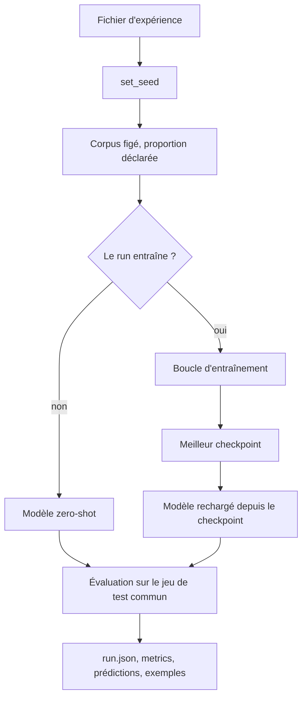

# Expériences et ablations

Une expérience est un fichier. Le lanceur ne lit rien d'autre : ni variable d'environnement, ni valeur passée en ligne de commande, à l'exception de l'endroit où les artefacts sont écrits. C'est ce qui rend la commande unique de la section 14 réellement unique.

## Le plan

Neuf expériences sont déclarées dans `configs/experiments/`.

--8<-- "_generated/plan.md"

Le « 100 % » désigne le corpus de travail de 20 000 exemples, jamais XSum complet. Voir la [page d'accueil](../index.md).

La campagne a été exécutée le 8 août 2026. Ce qu'elle porte est relu depuis les enregistrements de runs :

--8<-- "_generated/campaign.md"

Chaque score est mesuré sur les 1 000 exemples du split test, et aucun modèle n'a produit de résumé vide.

## Un fichier par expérience

```yaml
experiment:
  name: scratch_10
  seed: 42
  studies: [dataset_size]
  description: Transformer from scratch sur 10 pour cent du corpus de travail.

dataset:
  config: configs/data/xsum.yaml
  percentage: 10

model:
  type: scratch
  d_model: 256
  num_heads: 8
  encoder_layers: 4
  decoder_layers: 4
  d_ff: 1024
  dropout: 0.1
  max_position: 512

training:
  epochs: 10
  batch_size: 8
  gradient_accumulation_steps: 4
  learning_rate: 0.0003
  scheduler: linear
  warmup_ratio: 0.06
  label_smoothing: 0.1
  early_stopping_patience: 3
  device: auto

evaluation:
  split: test
  max_new_tokens: 64
  num_beams: 4
  no_repeat_ngram_size: 3
  bootstrap_samples: 1000
```

Quatre règles sont refusées au chargement, pas laissées à la relecture.

**La graine appartient au bloc `experiment`.** `TrainingConfig` porte un champ `seed` parce que la boucle en a besoin. Si un fichier pouvait le fixer aussi, un run pourrait déclarer `experiment.seed: 7` et s'entraîner sous 42 : le run réussirait et l'enregistrement rapporterait la mauvaise valeur. Une graine sous `training` est donc refusée, et celle de l'expérience y est injectée.

**Un run zero-shot ne peut pas porter de proportion.** Ses poids ne bougent pas, donc il ne dépend pas de la taille du corpus d'entraînement. La section 11 interdit de créer trois expériences zero-shot identiques ; déclarer une proportion sur celle-ci classerait une mesure sous un corpus que le modèle n'a jamais vu, ce qui est la même invention en un fichier au lieu de trois.

**Un run entraîné doit porter les deux.** Un bloc `training` sans proportion n'a pas de corpus, une proportion sans bloc `training` déclare des données que rien ne lit.

**Le nom est un nom de répertoire.** Il devient le répertoire du run et la clé de ligne de chaque tableau, donc il est restreint aux minuscules, aux chiffres et aux tirets bas.

## Ce que fait un run



**Les poids évalués sont relus depuis le checkpoint.** À la fin de l'entraînement, les poids en mémoire sont ceux de la dernière époque, et l'early stopping existe précisément parce que ce n'est pas la meilleure. Les deux modèles sont donc reconstruits depuis le meilleur checkpoint avant d'être mesurés. Le rechargement coûte une construction de modèle et achète deux choses : le score reporté appartient aux poids que le run a sélectionnés, et un checkpoint illisible échoue ici plutôt que dans l'API trois lots plus tard.

**Les deux modèles suivent les mêmes étapes.** Le Transformer from scratch et `t5-small` diffèrent par leur construction et par leur adaptateur de perte, et par rien d'autre : même corpus, même chargeur, même boucle, même décodage, même métrique. Le zero-shot saute l'étape d'entraînement parce que ses poids ne bougent pas, pas parce qu'il emprunte un autre chemin.

## Commandes

```bash
# Une expérience
python -m src.experiments.run --config configs/experiments/scratch_10.yaml

# Toutes les expériences déclarées, dans l'ordre des noms
python -m src.experiments.run --all

# Vérifier la mécanique sans produire de résultat
python -m src.experiments.run --config configs/experiments/scratch_10.yaml --limit 50

# Reprendre un entraînement interrompu
python -m src.experiments.run --config configs/experiments/scratch_100.yaml --resume

# Agréger ce qui a été mesuré
make ablation

# Tracer les figures de la section 18
make figures
```

`make train-scratch`, `make train-pretrained` et `make evaluate` appellent le même lanceur sur `scratch_100.yaml`, `pretrained_ft_100.yaml` et `pretrained_zero_shot.yaml`.

`--all` ne s'arrête pas à la première erreur. Une expérience qui lève écrit un enregistrement `FAILED` portant son message, le balayage continue, et le code de sortie vaut 1 : une campagne ne peut pas se terminer en vert avec une mesure manquante.

## Ce qu'un run écrit

```text
reports/results/<nom>/
├── run.json           configuration, corpus, modèle, matériel, statut
├── metrics.json       scores de corpus et intervalles
├── predictions.jsonl  une prédiction par ligne, avec ses scores
├── qualitative.json   meilleurs, pires et tirés au hasard
└── history.json       courbes d'entraînement et de validation

runs/<nom>/
├── best.pt            le checkpoint que l'évaluation relit
└── checkpoint-*.pt    checkpoints périodiques, en rotation
```

Les checkpoints sont hors de `reports/` : les résultats sont publiés comme artefacts de pipeline, les poids vont au registre de modèles.

## Les tableaux

`make ablation` produit les quatre fichiers de la section 17.

```text
reports/results/experiments.csv              une ligne par expérience déclarée
reports/results/ablation_dataset_size.csv    la courbe de la section 11
reports/results/ablation_architecture.csv    le balayage de la section 12
reports/results/qualitative_examples.json    les exemples, tous modèles confondus
```

Rien n'y est calculé. Chaque nombre est recopié d'un enregistrement de run, et une cellule sans mesure derrière elle reste vide. Un générateur capable d'inventer un chiffre rendrait inapplicable la règle de la section 17, qui interdit de modifier ces fichiers à la main.

### Le vocabulaire des statuts

| Statut | Ce qu'il dit |
| --- | --- |
| `OK` | run complet sur la totalité du split, seul cas qui remplit une colonne de score |
| `PARTIAL` | run limité par `--limit` ou entraînement plafonné par `max_steps` |
| `FAILED` | run interrompu par une erreur, message conservé |
| `NOT_RUN` | expérience déclarée, jamais exécutée |

Trois propriétés méritent d'être dites, parce qu'un tableau qui les rate ressemble quand même à un résultat.

**Chaque expérience déclarée garde sa ligne.** Un tableau de six lignes là où neuf expériences sont déclarées se lit comme une étude terminée.

**Une cellule vide n'est pas un zéro.** Un zéro est une mesure. Rendre une mesure absente par un zéro placerait sur la courbe, tout en bas, un modèle qui n'a jamais tourné.

**Un run partiel ne remplit pas la case d'un run complet.** Il écrit dans un répertoire suffixé par `_partial`, garde sa ligne et son statut, et laisse ses colonnes de score vides. Un score sur cinquante documents présenté à côté de scores sur mille est le résultat inventé de la section 44, avec une étape de plus.

### Le refus de comparer l'incomparable

Le budget de décodage, la largeur de faisceau et les réglages de ROUGE voyagent à l'intérieur de chaque enregistrement. L'agrégation les compare entre les runs d'une même étude et refuse d'écrire le tableau si deux d'entre eux divergent.

L'écart entre deux modèles mesurés différemment rapporte les réglages et non les modèles, et rien sur la page ne le montrerait.

## Les figures

`make figures` produit les quatre images de la section 18.

```text
reports/figures/performance_vs_dataset_size.png   la courbe de la section 11
reports/figures/training_loss.png                 une courbe par run entraîné
reports/figures/validation_loss.png               une courbe par run entraîné
reports/figures/model_comparison.png              les trois ROUGE, par expérience
```

Les figures sont tracées depuis les enregistrements de run, pas depuis les CSV que l'agrégation produit. Les deux sorties descendent ainsi de la même source, et aucune ne peut contredire l'autre.

Cinq règles valent d'être dites, parce qu'une image se sépare de son tableau dès qu'elle est collée dans une présentation.

**Seul un run complet devient un point.** Un run `PARTIAL` ou `FAILED` ne porte pas de score reportable. La règle est celle des tableaux, et elle compte davantage ici : sur une courbe, un point est un point.

**Ce qui manque est écrit sur l'image.** Une expérience sans mesure apparaît en note de bas de figure, avec son statut. Une figure qui laisse tomber silencieusement trois expériences sur neuf ressemble à une étude terminée.

**Les intervalles sont toujours tracés.** Les bornes bootstrap accompagnent chaque score dans l'enregistrement. Sans elles, un lecteur classe deux modèles sur un écart de deux millièmes, ce que l'ablation d'architecture montre précisément ne pas être établi.

**Le zero-shot est une ligne horizontale, pas un point.** Ses poids ne dépendent pas du corpus d'entraînement ; le placer à une proportion quelconque revendiquerait une mesure que personne n'a prise.

**Des runs mesurés différemment ne vont pas sur une même figure.** Le contrôle est celui des tableaux, appliqué par la même fonction.

Les images ne sont pas versionnées. `reports/figures/` est ignoré comme `reports/results/` : ce sont des sorties de la chaîne, publiées comme artefacts de pipeline, et une image dans l'historique du dépôt vieillit sans que rien ne le signale.

## Les tableaux de la documentation

Les figures publiées suivaient déjà une nouvelle campagne, parce qu'une page cite un fichier image. Les tableaux, eux, étaient recopiés à la main : une nouvelle campagne déplaçait les enregistrements, les CSV et les images, et laissait le [Rapport](../report.md) et cette page énoncer les chiffres de la précédente. Rien n'échouait, et une documentation fausse est pire qu'une documentation absente.

`make report-sync` produit les fragments que les deux pages incluent.

```text
docs/_generated/campaign.md         ce que la campagne porte, et d'où elle vient
docs/_generated/plan.md             une ligne par expérience déclarée, statut compris
docs/_generated/dataset_size.md     la courbe de la section 11, en tableau
docs/_generated/architecture.md     le balayage de la section 12
docs/_generated/capitalisation.md   la majuscule initiale, par modèle
```

Quatre règles les encadrent.

**Un chiffre est calculé ou raconté, jamais les deux.** La prose reste écrite à la main : c'est la lecture des résultats, et elle ne se génère pas. Ce qu'elle cesse de porter, ce sont les valeurs. Chaque tableau est devenu une inclusion, et une inclusion manquante fait échouer `mkdocs build --strict` au lieu de rendre une page silencieusement amputée de son tableau.

**La source est l'enregistrement de run**, comme pour les CSV et pour les figures. Même lecteur, même refus de comparer l'incomparable, un seul arrondi. Un fragment construit depuis `experiments.csv` serait la copie d'une copie, arrondie une fois de plus, et libre de contredire la figure d'à côté.

**Le taux de majuscule initiale est mesuré ici, pas recopié.** C'est le seul chiffre de ces pages qu'aucun enregistrement ne porte, donc il est recompté depuis les `predictions.jsonl` que les runs ont écrits. Ce fichier est un artefact de l'évaluation : rien n'est généré, décodé ni scoré à nouveau.

**La vérification est mécanique.** `scripts/check_docs_sync.py` régénère les fragments et compare, comme il le fait déjà pour `openapi.json`. Un fragment périmé fait échouer `make docs-lint` et le hook `pre-push`, avec la commande à lancer. Sur une machine sans campagne, `reports/results/` étant ignoré par git, la vérification rend `PENDING` et jamais `OK` : une comparaison qui n'avait rien à comparer ne doit pas se lire comme une concordance.

Deux choses restent écrites à la main, et le sont volontairement. La date de la campagne, qu'aucun enregistrement ne porte, et les rapports que la prose tire des tableaux, du type « 43 % de mieux à 10 % ». Ces derniers sont l'analyse : si les chiffres bougeaient, ce sont les conclusions qu'il faudrait réécrire, pas seulement les nombres.

## Ablation sur la taille du corpus

La section 11 demande 10 %, 50 % et 100 % du jeu d'entraînement, pour le modèle from scratch et pour le modèle pré-entraîné fine-tuné, plus une mesure zero-shot.

Les sous-ensembles sont emboîtés : 10 % est un préfixe de 50 %, lui-même préfixe de 100 %. L'emboîtement isole l'effet de la taille de celui de la composition de l'échantillon.

Le budget d'époques est constant sur les trois proportions. Le faire varier ferait bouger deux grandeurs à la fois, et l'écart ne serait plus attribuable. Un corpus dix fois plus petit donne dix fois moins de pas d'optimisation : c'est précisément l'effet mesuré.

Le zero-shot occupe une seule ligne, et sa cellule `dataset_percentage` est vide. Il n'a pas été entraîné sur rien, il n'a pas été entraîné. La figure de la section 18 le trace en ligne horizontale de référence, pas en point de la courbe.

### Ce que la mesure donne

--8<-- "_generated/dataset_size.md"

Trois lectures, toutes appuyées sur des intervalles disjoints.

**L'écart entre les deux familles ne se referme pas.** Il vaut 43 % en relatif à 10 %, 39 % à 50 % et 41 % à 100 %. Les deux courbes montent en parallèle. Donner plus de données au modèle from scratch ne le rapproche pas du modèle pré-entraîné, parce que le pré-entraîné en profite autant. C'est un résultat plus fort que le simple classement : sur la plage mesurée, aucune quantité de données atteignable ne comble l'écart.

**Le pré-entraînement vaut plus que dix fois les données annotées.** `pretrained_ft_10` obtient 0,1791 sur 2 000 exemples en 218 secondes. `scratch_100` obtient 0,1634 sur 20 000 exemples en 1 761 secondes. Dix fois moins de données, huit fois moins de calcul, meilleur score.

**Le zero-shot situe le point de croisement.** À 0,1366 il devance le modèle from scratch entraîné sur 2 000 exemples et se fait dépasser entre 2 000 et 10 000. C'est une façon concrète de chiffrer ce que vaut le pré-entraînement, exprimée en exemples annotés.

Le rendement est décroissant des deux côtés. Pour le modèle from scratch, passer de 10 % à 50 % gagne 24 % en relatif, passer de 50 % à 100 % n'en gagne plus que 5 %.

### La longueur générée, mesurée à part

`prediction_words_mean` sépare le zero-shot de tout le reste.

```text
référence                    21,3 mots
pretrained_zero_shot         36,4 mots
tous les modèles entraînés   17,3 à 19,4 mots
```

Le zero-shot produit des sorties une fois et demie plus longues que la référence, les modèles entraînés se calent légèrement en dessous. C'est la mesure de ce que le fine-tuning apprend ici : non pas la langue, que `t5-small` connaît déjà, mais le format XSum, une phrase unique et dense. La lecture des exemples le confirme, le zero-shot recopie des fragments du document, y compris des éléments d'habillage de la page source.

## Ablation d'architecture

La section 12 demande une seconde comparaison et donne sa préférence au nombre de couches. C'est la grandeur retenue.

| Expérience | Couches | `d_model` | Têtes | `d_ff` |
| --- | --- | --- | --- | --- |
| `scratch_100_layers2` | 2 + 2 | 256 | 8 | 1024 |
| `scratch_100` | 4 + 4 | 256 | 8 | 1024 |
| `scratch_100_layers6` | 6 + 6 | 256 | 8 | 1024 |

Une seule grandeur bouge. Tout le reste est identique, corpus compris.

`scratch_100` appartient aux deux études. C'est ce qui limite la seconde ablation à deux entraînements supplémentaires au lieu de trois, ce que la section 12 demande explicitement de faire pour rester compatible avec les ressources matérielles.

Trois points suffisent à distinguer une profondeur qui aide d'une profondeur qui sature. Aller au-delà coûterait un entraînement complet par point.

### Ce que la mesure donne

--8<-- "_generated/architecture.md"

**Le résultat est négatif, et il est présenté comme tel.** Le ROUGE-L décroît quand la profondeur augmente. Aucune paire n'est séparée au seuil de 95 %, tous les intervalles se recouvrent, donc aucune différence individuelle n'est établie. Ce qui reste est que trois runs indépendants classent dans le même sens, et qu'aucun gain n'apparaît là où la profondeur augmente de 2,2 fois le temps de calcul.

**Les deux mesures ne classent pas dans le même ordre.**

| Profondeur | Perte de validation | ROUGE-L |
| --- | --- | --- |
| 2 + 2 | 5,1311 | 0,1657 |
| 4 + 4 | 5,0341 | 0,1634 |
| 6 + 6 | 5,0373 | 0,1573 |

La perte de validation place la profondeur 4 en tête et sature ensuite, le ROUGE place la profondeur 2 en tête. Ce n'est pas contradictoire : la perte mesure la prédiction du token suivant sous forçage par la référence, le ROUGE mesure un texte produit en génération autorégressive avec faisceau. Un modèle peut gagner sur la première sans gagner sur le second. C'est la justification concrète du choix de reporter le ROUGE plutôt que la perte.

**Le compte de paramètres explique le non-résultat.** La table d'embedding pèse 32 100 × 256, soit 8 217 600 paramètres, donc 69 % du modèle à 2 couches et 53 % du modèle à 4 couches. Faire varier la profondeur ne fait varier qu'une minorité du modèle. L'analyse du corpus ajoute la moitié manquante de l'explication : 26,9 % de cette table n'est jamais mise à jour, faute d'occurrences. La conclusion n'est pas que la profondeur est sans effet en général, elle est qu'à `d_model` 256 et avec le vocabulaire T5, le levier est le vocabulaire et non la profondeur. Voir [Corpus](../ml/data.md).

## Décodage

Le bloc `evaluation` est identique dans les neuf fichiers.

```text
num_beams              4
max_new_tokens         64
min_new_tokens         0
no_repeat_ngram_size   3
bootstrap_samples      1000
```

`min_new_tokens` reste à zéro. Forcer un modèle à continuer au-delà du point où il voulait s'arrêter relèverait le score d'un modèle qui n'a rien appris à dire, et le compte des prédictions vides sépare déjà un score faible d'un modèle cassé.

**Les deux côtés de la comparaison sont publiés.** `scratch:v1` vient de `scratch_100`, `pretrained:v1` de `pretrained_ft_100`. Les quatre runs `pretrained_*` ont été refaits sous la révision `df1b051c` de `t5-small` : le registre refuse une révision non épinglée, et il lit le bloc modèle de l'enregistrement, pas celui de la configuration courante. Voir [Registre de modèles](../ml/registry.md).

**Un entraînement est suivable pendant qu'il tourne.** `src/tracking/live.py` ouvre le run MLflow avant la première époque et y pousse la perte, le taux d'apprentissage et la norme du gradient. `main` configure la journalisation, donc `LoggingCallback` affiche la même progression sur la console, et `--verbose` descend au niveau DEBUG. Seul `history.json` continue d'être écrit à la fin.

## Rejouer la campagne entière

**`make reproduce` enchaîne les cinq étapes de la section 41.** Corpus, expériences, tableaux, figures, tableaux de la documentation, dans cet ordre, et la chaîne s'arrête à la première étape qui échoue plutôt que d'agréger les enregistrements d'une campagne interrompue.

```bash
make reproduce MODE=quick   # neuf runs plafonnes, tout sous reports/quick/, aucun résultat
make reproduce MODE=full    # la campagne réelle
```

Le mode `quick` rejoue les neuf fichiers de ce répertoire sur deux pas d'optimisation et huit documents de test. Ses enregistrements sortent en `PARTIAL` par les mêmes règles que celles décrites plus haut, donc les tableaux et les figures qu'il produit ont toutes leurs colonnes de score vides. C'est ce qui en fait une vérification et non une campagne au rabais. Le détail est sur la page [Reproductibilité](../reproducibility.md).
