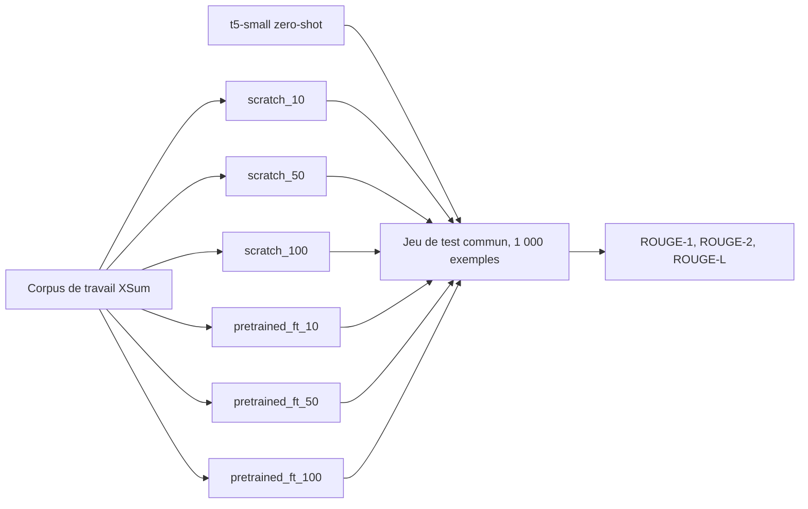

# Syntra

Backend NLP expérimental de **résumé automatique**. Le projet compare un Transformer encodeur-décodeur écrit à la main en PyTorch à un modèle pré-entraîné T5, en zero-shot puis fine-tuné, sur un jeu de test strictement identique.

Le frontend ne fait pas partie de ce lot. Le backend expose un contrat API stable pour qu'il puisse être développé séparément.

## Démarrage

```bash
py -3.12 -m venv .venv && source .venv/Scripts/activate   # Linux, macOS : .venv/bin/activate
make install
make reproduce MODE=quick
```

Trois commandes après le clonage. La dernière enchaîne la chaîne scientifique entière sur un budget plafonné : elle vérifie que ce poste sait l'exécuter, et ne produit aucun résultat. La campagne réelle se rejoue avec `MODE=full`. Les deux modes sont décrits sur la page [Reproductibilité](reproducibility.md).

Sous Windows, `make` s'appelle depuis Git Bash. Le `README.md` du dépôt explique pourquoi et comment.

## Décisions verrouillées

| Sujet | Choix |
| --- | --- |
| Tâche | Résumé automatique |
| Métriques | ROUGE-1, ROUGE-2, ROUGE-L |
| Métrique reportée | ROUGE-L, F-mesure |
| Modèle from scratch | Transformer encodeur-décodeur PyTorch |
| Modèle pré-entraîné | `t5-small` (Hugging Face) |
| Tokenizer | Tokenizer T5, partagé par les deux modèles |
| Corpus | XSum (`EdinburghNLP/xsum`) |
| Matériel | GPU NVIDIA local, précision mixte activée |
| Langue du code | Anglais, docstrings comprises |
| Langue de la documentation | Français |

La traduction et la métrique BLEU sont hors périmètre.

## Le « 100 % » désigne le corpus de travail

XSum complet compte environ 204 000 exemples d'entraînement. Ce volume dépasse le budget d'un GPU portable de 8 Go pour un entraînement from scratch suivi de trois fine-tunings.

Le projet travaille donc sur un sous-ensemble figé, tiré une seule fois avec la graine 42 :

| Split | Taille |
| --- | --- |
| Entraînement | 20 000 exemples |
| Validation | 1 000 exemples |
| Test | 1 000 exemples |

Les proportions d'ablation portent sur ce corpus de travail : 10 % vaut 2 000 exemples, 50 % vaut 10 000, 100 % vaut 20 000.

Tout score publié se rapporte à ce corpus. Le présenter comme un score sur XSum complet serait une donnée inventée.

## Comparaisons produites



Le zero-shot ne dépend pas de la taille du corpus d'entraînement. Il donne donc une seule mesure, pas trois.

## État d'avancement

L'ordre d'implémentation suit la section 43 du cahier des charges.

| Étape | Contenu | État |
| --- | --- | --- |
| 1 à 3 | Requirements, architecture, bootstrap du dépôt | Fait |
| 4 | Outillage qualité, hooks, tests | Fait |
| 5 | Data pipeline | Fait, corpus construit |
| 6 et 7 | Transformer from scratch et ses tests | Fait |
| 8 | Pipeline d'entraînement | Fait |
| 9 | Baseline pré-entraînée | Fait |
| 10 | Évaluation, ROUGE et analyse qualitative | Fait |
| 11 | Ablations | Fait, les neuf expériences mesurées |
| 12 | Traçabilité MLflow | Fait, neuf runs dans le magasin |
| 13 | Model Registry | Fait, `scratch:v1` et `pretrained:v1` publiés |
| 14 | API FastAPI | Fait, `champion` et `challenger` résolus |
| 15 | Docker et scan Trivy | Écrit, aucune image construite |
| 16 et 17 | CI/CD GitHub Actions et déploiement | Pipeline écrit et validé localement, jamais exécuté sur un runner ; déploiement à faire |
| 18 | Documentation et GitHub Pages | En cours |

Les cinq expériences `scratch_*` ont été exécutées le 8 août 2026, les quatre `pretrained_*` refaites le 9 août sous une révision épinglée. Le résultat principal, mesuré sur les 1 000 exemples du split test :

--8<-- "_generated/headline.md"

Le modèle pré-entraîné fine-tuné sur 2 000 exemples devance le Transformer from scratch entraîné sur 20 000. Le détail et les deux ablations sont sur la page [Expériences et ablations](experiments/index.md).

Ces chiffres sont reproductibles par un tiers : les quatre mesures `t5-small` ont été refaites sous la révision `df1b051c`, épinglée dans les fichiers `pretrained_*`. Voir la page [Conformité aux requirements](conformity.md).

## Par où commencer

- [Corpus](ml/data.md) : composition, empreintes, statistiques mesurées, justification des troncatures.
- [Transformer from scratch](ml/transformer.md) : formule d'attention, masques, choix d'architecture.
- [Baseline pré-entraînée](ml/baseline.md) : `t5-small` en zero-shot puis fine-tuné, décodage partagé.
- [Entraînement](ml/training.md) : boucle, batching groupé par longueur, checkpoints.
- [Évaluation](ml/evaluation.md) : ROUGE, interface partagée, intervalle de confiance, analyse qualitative.
- [Expériences et ablations](experiments/index.md) : les neuf expériences déclarées, le format d'un fichier, les tableaux et leurs statuts.
- [Conformité aux requirements](conformity.md) : chaque exigence de l'énoncé, l'endroit qui la satisfait, et ce qui reste à exécuter.
- [Traçabilité MLflow](ml/tracking.md) : ce qui est tracé, ce qui ne l'est pas, et pourquoi un run partiel n'a pas de score.
- [Registre de modèles](ml/registry.md) : versions, alias `champion` et `challenger`, révisions épinglées.
- [API](api/index.md) : contrat versionné, résolution d'un modèle, décodage, enveloppe d'erreur, sondes.
- [Reproductibilité](reproducibility.md) : graines, corpus figé, commande unique, chaîne complète en modes `quick` et `full`.
- [Tests](testing.md) : niveaux de test et seuil de couverture.
- [Déploiement](deployment.md) : les trois images, la stack locale, ce qui est vérifié sans Docker.
- [Sécurité](security.md) : Bandit, Trivy, gestion des exceptions.
- [Contribuer](contributing.md) : hooks, format de commit, commandes qualité.
- [Glossaire](glossary.md) : terminologie imposée par le linter de prose.
