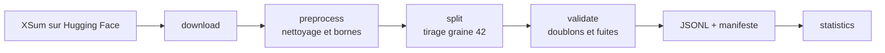

# Corpus

## Chaîne de préparation



Commande unique :

```bash
make data
# soit : python -m src.data.build --config configs/data/xsum.yaml
```

La commande est idempotente. Deux exécutions avec la même configuration produisent des fichiers identiques, donc le même `dataset_version`.

## Du corpus amont au corpus de travail

| Étape | Entraînement | Validation | Test |
| --- | --- | --- | --- |
| XSum amont | 204 045 | 11 332 | 11 334 |
| Après nettoyage et bornes | 203 008 | 11 264 | 11 272 |
| Corpus de travail | **20 000** | **1 000** | **1 000** |

Le nettoyage écarte entre 0,51 % et 0,60 % des exemples selon le split : documents de moins de 200 caractères ou de plus de 20 000, résumés de moins de 20 caractères ou de plus de 1 000.

Le corpus de travail est tiré une seule fois avec la graine 42. Chaque split reçoit une graine dérivée, de sorte que changer la taille d'entraînement ne modifie ni la validation ni le test.

!!! warning "Ce que « 100 % » désigne"
    Les proportions d'ablation portent sur le corpus de travail : 10 % vaut 2 000 exemples, 50 % vaut 10 000, 100 % vaut 20 000. Aucun score du projet ne porte sur les 204 045 exemples de XSum complet.

## Sous-ensembles emboîtés

Le split d'entraînement est stocké dans un ordre déjà mélangé. Chaque proportion est donc un préfixe du fichier :

```text
train_10  = 2 000 premiers exemples de train.jsonl
train_50  = 10 000 premiers exemples de train.jsonl
train_100 = train.jsonl entier
```

L'emboîtement est délibéré. Si les trois sous-ensembles étaient tirés indépendamment, un écart de score entre 10 % et 50 % mélangerait deux causes : la taille et la composition de l'échantillon. Emboîtés, seule la taille varie.

Aucun fichier supplémentaire n'est nécessaire, et le manifeste porte un checksum par proportion.

## Empreintes

Le manifeste enregistre un SHA-256 par split et par proportion, calculé sur les identifiants, les documents et les résumés, dans l'ordre. Un réordonnancement, un ajout ou une modification d'un seul caractère change l'empreinte.

Le `dataset_version` couvre les trois splits réunis. C'est la valeur tracée dans MLflow avec chaque expérience.

Corpus actuellement construit :

--8<-- "_generated/checksums.md"

## Contrôles bloquants

Le build échoue, il ne prévient pas, si :

```text
un document ou un résumé est vide
un identifiant apparaît deux fois dans un split
un identifiant est partagé entre deux splits
un document est partagé entre deux splits, même sous un identifiant différent
```

Le contrôle sur le texte du document, et pas seulement sur l'identifiant, est celui qui compte : deux exemples peuvent porter des identifiants différents et le même document, ce qui contaminerait le jeu de test tout aussi efficacement.

Un contrôle est informatif et non bloquant : un résumé plus long que son document. Le corpus de travail en compte un seul, et deux documents en double dans l'entraînement.

## Statistiques mesurées

Sur le corpus de travail construit, tokenizer `t5-small`.

--8<-- "_generated/statistics.md"

Le taux de compression est le rapport moyen entre le nombre de mots du résumé et celui du document. Autour de 0,095, il confirme la nature de XSum : un résumé d'une phrase pour un article entier.

## Justification des longueurs de troncature

```text
max_source_tokens = 512
max_target_tokens = 64
```

Ces valeurs ne sont pas arbitraires, elles sont choisies au vu des distributions ci-dessus.

**Côté cible, 64 tokens est confortable.** Le p95 des résumés est à 43 tokens, bien en dessous du plafond, et la troncature reste sous le pour cent sur les trois splits. La quasi-totalité des résumés de référence passent entiers.

**Côté source, 512 tokens tronque 38 % des documents.** C'est le point le plus discutable de la configuration, et il doit être assumé explicitement plutôt que découvert après coup.

Ce que les deux plafonds coupent, sur le corpus construit :

--8<-- "_generated/truncation.md"

Trois raisons motivent ce choix malgré tout :

1. **C'est la valeur de référence de la littérature sur XSum.** Comparer nos scores à des scores publiés suppose une troncature comparable.
2. **Le coût de l'attention est quadratique.** Passer à 1 024 tokens multiplie par quatre la mémoire des cartes d'attention. Sur les 8 Go de la carte cible, cela réduirait la taille de lot au point de rendre l'entraînement du modèle from scratch impraticable dans le budget du projet.
3. **XSum est un corpus de presse.** L'information nécessaire au résumé d'une phrase se concentre en tête d'article. Tronquer la fin coûte moins que sur un corpus où l'information est répartie.

Cette limite s'applique **identiquement aux deux modèles**. Elle ne biaise donc pas la comparaison, mais elle borne les scores absolus atteignables. Elle est rappelée avec chaque tableau de résultats.

## Tokenizer partagé

Les deux modèles utilisent le tokenizer `t5-small`, avec le préfixe `"summarize: "` côté source, espace final compris.

Ce partage est une décision de conception, pas une commodité. Entraîner un tokenizer dédié au modèle from scratch introduirait une seconde variable : un écart de score ne se laisserait plus attribuer à l'architecture, puisque le vocabulaire et la segmentation différeraient aussi. Avec un tokenizer commun, la comparaison porte sur les modèles seuls.

### Ce que ce partage coûte au modèle from scratch

Le tokenizer est neutre pour la baseline, dont les embeddings sont déjà entraînés. Il ne l'est pas pour le modèle from scratch, dont la table d'embedding est le plus gros bloc de paramètres et doit être apprise à partir de rien.

| Mesure | Valeur |
| --- | --- |
| Entrées du tokenizer | 32 100 |
| Types observés au moins une fois dans l'entraînement | 23 458 (73,1 %) |
| Types jamais observés | 8 642 (26,9 %) |
| Types vus moins de dix fois | 4 199 |
| Types couvrant 50 % des occurrences | 100 |
| Types couvrant 99 % des occurrences | 14 510 |

Les 8 642 entrées jamais vues représentent 2 212 352 paramètres, soit **14,2 % du modèle from scratch qui ne reçoit jamais de gradient**. Un tokenizer réduit au corpus libérerait ces paramètres, mais casserait le partage décrit ci-dessus et donc l'équité de la comparaison. Le compromis est retenu en connaissance de cause, et il explique le résultat de l'ablation d'architecture : à `d_model` 256, la profondeur ne fait varier qu'une minorité des paramètres.

## Analyse exploratoire

```bash
jupyter lab notebooks/01_eda_xsum.ipynb   # ou l'ouvrir dans l'éditeur
```

Le notebook `notebooks/01_eda_xsum.ipynb` reprend ces mesures et les relie chacune à une décision : volume et emboîtement des sous-ensembles, valeurs manquantes, doublons, fuite entre splits, distributions de longueur en caractères, mots et tokens, effet de cinq plafonds de troncature, ratio de compression, couverture du vocabulaire, fragmentation en sous-mots, exemples extrêmes et budget de tokens par proportion.

Il ne recalcule rien que `python -m src.data.build` ait déjà écrit : il relit `manifest.json` et `statistics.json`, ce qui garantit que le notebook et l'entraînement parlent du même corpus.

Ses sorties sont retirées à chaque commit par le hook `nbstripout`, un notebook versionné avec ses sorties étant illisible en revue et faux dès que le corpus change. Les chiffres qui comptent ne transitent donc pas par lui : les tableaux ci-dessus sont émis par `python -m src.data.fragments` depuis les deux mêmes fichiers, et `scripts/check_docs_sync.py` échoue si l'un d'eux cesse de correspondre au corpus construit.

## Format sur disque

```text
data/processed/xsum/
├── train.jsonl        20 000 lignes, ordre mélangé figé
├── validation.jsonl    1 000 lignes
├── test.jsonl          1 000 lignes
├── manifest.json       tailles, checksums, proportions, tokenizer
└── statistics.json     distributions en caractères, mots et tokens
```

Une ligne JSONL porte trois champs : `id`, `source`, `target`.

Rien en aval ne lit ces fichiers directement. Tout passe par `src/data/dataset.py`, ce qui permet de changer le format sans toucher aux expériences.
