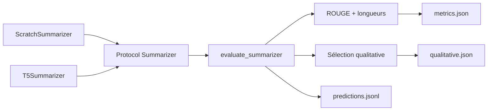

# Évaluation

Toutes les comparaisons du projet passent par un seul chemin de code : `src/evaluation/evaluator.py` reçoit un modèle, un split du corpus figé, une configuration de décodage, et produit un score. Le modèle from scratch et `t5-small` empruntent ce chemin sans branchement, parce qu'un branchement par modèle est exactement l'endroit où une comparaison cesse d'être équitable.

## Ce qui est mesuré

| Élément | Valeur |
| --- | --- |
| Métriques | ROUGE-1, ROUGE-2, ROUGE-L |
| Métrique reportée | ROUGE-L, F-mesure |
| Implémentation | `rouge-score`, la référence de la littérature |
| Segmentation | celle de `rouge-score` : minuscules, découpage sur les caractères non alphanumériques |
| Racinisation | activée (Porter), identique pour tous les modèles |
| Jeu de test | les 1 000 exemples de test du corpus de travail, identiques partout |

### Pourquoi ROUGE n'est pas réimplémenté

Le cahier des charges impose `rouge-score` en section 4, et c'est l'implémentation contre laquelle les scores publiés sur XSum sont rapportés. Une version écrite à la main qui différerait d'un dixième de point rendrait chaque chiffre de ce projet incomparable avec la littérature, et l'écart serait invisible : les deux ressembleraient à des scores plausibles.

Ce que `src/metrics/rouge.py` possède, c'est tout ce qui entoure l'appel, et c'est là qu'une comparaison casse réellement.

### L'ordre des arguments est verrouillé

`RougeScorer.score` attend la référence en premier et la prédiction en second. Inverser les deux ne change pas la F-mesure : l'erreur survit donc à n'importe quel test écrit sur F seule, pendant que la précision et le rappel échangent silencieusement leur valeur. `score_example` fixe l'ordre une fois, et un test unitaire l'épingle sur un cas asymétrique dont les valeurs sont calculées à la main.

### ROUGE-L, pas ROUGE-Lsum

`rougeLsum` découpe sur les retours à la ligne et prend une union des plus longues sous-séquences communes phrase par phrase. Les références XSum tiennent en une phrase : les deux variantes coïncident sur les références et ne divergent que sur une génération multi-phrases, où `rougeLsum` avantagerait discrètement un modèle qui délaye. La section 2.1 dit ROUGE-L, et c'est ROUGE-L qui est mesuré. La configuration refuse explicitement toute autre variante.

## Trois règles d'honnêteté

### Une génération vide vaut zéro et reste dans la moyenne

Écarter les documents sur lesquels un modèle a échoué reviendrait à augmenter sa moyenne parce qu'il a échoué. Les prédictions vides sont donc comptées à part, à côté du score : une moyenne de 0,05 sur mille documents ne se lit pas comme une moyenne de 0,05 sur cent documents et neuf cents échecs.

### Les longueurs générées accompagnent le score

Un modèle qui produit quatre mots là où les références en comptent vingt n'est pas un modèle faible, c'est un modèle cassé, et son ROUGE ressemble seulement à un ROUGE bas. Les distributions de longueur des prédictions et des références figurent dans le rapport, pour que les deux se lisent ensemble.

### Un run partiel le dit

L'option `--limit` sert à exercer la chaîne sans attendre mille documents. Le rapport porte alors `partial: true` et le répertoire de sortie reçoit le suffixe `_partial`, de sorte qu'une mesure incomplète ne puisse jamais écraser une mesure complète ni être confondue avec elle. La section 44 traite un chiffre présenté mais non mesuré comme un résultat inventé, et un score sur cinquante documents présenté comme le score du jeu de test en est un.

## L'intervalle de confiance

La moyenne d'un corpus invite à lire un écart de trois dixièmes de point comme un résultat. Le module rééchantillonne donc les scores par exemple, avec remise, et rapporte l'intervalle de percentile à 95 % de la moyenne rééchantillonnée. Le tirage part d'une graine fixe, donc l'intervalle est reproductible.

Ce que l'intervalle dit : de combien la moyenne bougerait si le jeu de test avait été tiré autrement. Ce qu'il ne dit pas : rien sur un autre corpus, et un recouvrement entre deux intervalles ne prouve pas que deux modèles se valent. Il sert à empêcher la lecture d'un écart qui tient dans le bruit d'échantillonnage, pas à trancher.

Il peut être désactivé avec `bootstrap_samples=0`, ce que font les tests unitaires qui n'en mesurent pas l'effet.

## L'interface partagée



Le protocole est structurel : `src/evaluation/protocol.py` déclare deux méthodes, `summarize` et `describe`, qu'aucun des deux modèles n'hérite. Les paquets de modèles n'importent donc pas le paquet d'évaluation, et la conformité est vérifiée par un test plutôt que par un arbre d'héritage.

`describe` n'est pas décoratif. La section 19 veut qu'un score rapporté porte ce qui l'a produit, et un modèle qui ne sait pas se décrire ne peut pas être évalué. Le mode en fait partie : un Transformer initialisé au hasard produit des résumés lui aussi, et classer son score comme celui du modèle from scratch serait un résultat inventé.

### L'adaptateur du modèle from scratch

`src/models/scratch/generation.py` renvoie des identifiants de tokens, la baseline renvoie des chaînes. `src/models/scratch/summarizer.py` comble l'écart et applique au passage ce que l'entraînement imposait :

- le préfixe du corpus, parce que le modèle a été entraîné sur des documents préfixés ;
- la troncature du corpus, pour couper les documents là où l'entraînement les coupait ;
- une vérification des identifiants de remplissage et de fin de séquence face au tokenizer.

Cette dernière refuse la construction plutôt que d'échouer plus tard. Un identifiant de remplissage divergent laisserait le remplissage être pris en compte par l'attention ; un identifiant de fin de séquence divergent laisserait la génération tourner jusqu'à son budget sur chaque document. Aucun des deux ne lève d'exception : les deux baissent le score en silence.

## L'analyse qualitative

Un écart de ROUGE dit qu'un modèle retrouve davantage de n-grammes de la référence. Il ne dit pas si le modèle le plus faible produit des phrases tronquées, recopie la première ligne du document, ou hallucine un résumé plausible d'autre chose. Seule la lecture répond, et lire suppose de choisir quoi lire.

La sélection retient trois groupes disjoints :

```text
best      les meilleurs scores ROUGE-L
worst     les pires
sample    un tirage aléatoire à graine fixe dans tout le reste
```

Le tirage n'est pas un supplément. Les extrêmes sont les deux exemples les moins représentatifs de la distribution : un modèle peut avoir un meilleur cas brillant, un pire cas catastrophique, et un milieu plat et générique qui est ce qu'il fait réellement. Les égalités se départagent sur l'identifiant de l'exemple, donc la sélection est stable d'une lecture à l'autre.

## Artefacts produits

Une évaluation écrit un répertoire sous `reports/results/` :

```text
metrics.json        modèle, split, décodage, ROUGE, longueurs, durée
predictions.jsonl   une ligne par exemple : identifiant, référence, prédiction, scores
qualitative.json    les exemples sélectionnés, documents compris
```

`predictions.jsonl` ne recopie pas les documents : l'identifiant pointe déjà sur le corpus figé, et répéter mille documents rendrait l'artefact plus gros que le split qu'il décrit. `qualitative.json` les garde, parce qu'ils sont ce qu'on y lit.

Rien n'est agrégé ici. La consolidation dans `reports/results/experiments.csv` et les tableaux d'ablation appartiennent au [lanceur d'expériences](../experiments/index.md), qui sait quels runs ont eu lieu.

## Commande

```bash
make evaluate
```

soit, en passant par le lanceur d'expériences, ce qui fait entrer la mesure dans les tableaux :

```bash
python -m src.experiments.run --config configs/experiments/pretrained_zero_shot.yaml
```

L'évaluateur reste appelable seul, pour une mesure ponctuelle qui n'appartient à aucune expérience déclarée :

```bash
python -m src.evaluation.evaluator \
  --config configs/data/xsum.yaml \
  --baseline t5
```

Options utiles :

```text
--model-dir PATH     évaluer des poids fine-tunés écrits par save_pretrained
--split validation   changer de split, le test restant le seul jeu reporté
--num-beams 4        recherche par faisceau au lieu du glouton
--limit 50           exercer la chaîne, run marqué partiel
```

Le décodage est toujours passé explicitement à l'évaluateur, jamais laissé au défaut de chaque modèle : ce qui est enregistré dans le run doit être ce qui a réellement servi.

## Ce qui n'est pas écrit

`src/evaluation/translation.py` figure dans l'arborescence de la section 16. La section 2.1 met la traduction hors périmètre, sans code ni métrique, ce qui laisse ce fichier sans contenu. SacreBLEU et chrF sortent du périmètre pour la même raison.

Évaluer tous les modèles en une commande supposait un registre des expériences. Il existe désormais : `python -m src.experiments.run --all` rejoue les neuf expériences déclarées, et `make ablation` agrège ce qui a été mesuré.

## État

Les neuf expériences ont été évaluées le 8 août 2026, chacune sur les 1 000 exemples du split test, avec le même décodage et les mêmes réglages de ROUGE.

--8<-- "_generated/metrics.md"

**Aucun modèle n'a produit de résumé vide**, sur aucun des neuf runs. Le compte de prédictions vides existe pour distinguer un score faible d'un modèle cassé ; il vaut zéro partout, donc les scores faibles de cette table sont bien des scores faibles.

**Les intervalles font leur travail sur l'ablation d'architecture.** Les trois profondeurs se recouvrent, ce qui interdit d'annoncer un gagnant entre 2, 4 et 6 couches. Sans eux, un écart de deux dixièmes de point aurait pu être présenté comme un résultat.

Une observation que le ROUGE seul ne donne pas, tirée de `prediction_words_mean` : le zero-shot génère 36,4 mots en moyenne contre 21,3 pour la référence, alors que tous les modèles entraînés se tiennent entre 17,3 et 19,4. Le zero-shot ne résume pas, il recopie. C'est ce que l'analyse qualitative montre document par document.
