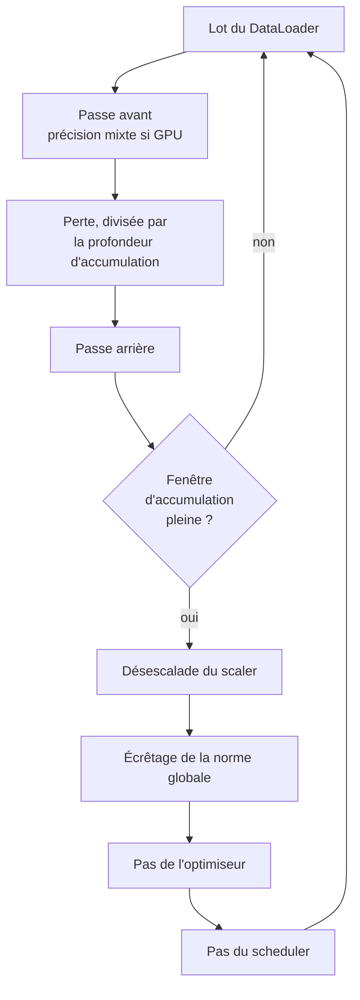

# Entraînement

## Composants

```text
src/training/
├── config.py           hyperparamètres validés du lot d'entraînement
├── sampler.py          batching groupé par longueur, et sa mesure
├── optimizer.py        AdamW, décroissance de poids sur les matrices seules
├── scheduler.py        warmup puis décroissance, par pas d'optimisation
├── early_stopping.py   arrêt sur la perte de validation
├── checkpoint.py       écriture, rotation, rechargement
├── callbacks.py        journalisation et collecte des courbes
├── state.py            enregistrements échangés entre boucle et observateurs
└── trainer.py          la boucle
```

La boucle ne fait que l'optimisation. L'observation passe par les callbacks, la persistance par le gestionnaire de checkpoints, la décision d'arrêt par l'early stopping. Ajouter un observateur ne demande donc pas de toucher à la boucle.

La fonction de perte est un paramètre du `Trainer`, pas une propriété de la boucle. C'est ce qui permet au fine-tuning de `t5-small` de réutiliser cette boucle telle quelle, avec le même écrêtage, les mêmes checkpoints et la même moyenne pondérée par les tokens. Voir [Baseline pré-entraînée](baseline.md).

## Boucle



En fin d'époque, la perte de validation est mesurée, l'early stopping est mis à jour, un checkpoint périodique est écrit, et le meilleur checkpoint est mis à jour si la perte a baissé.

La perte est pondérée par le nombre de tokens, pas par le nombre de lots. Les lots portent un nombre variable de tokens cibles : une moyenne simple sur les lots donnerait le même poids à un résumé court qu'à un résumé long, et la courbe d'entraînement ne serait plus comparable à celle de validation.

## Batching groupé par longueur

C'est le point qui a demandé une mesure avant d'être corrigé.

### Le constat

Le collateur pad chaque lot à sa propre séquence la plus longue, donc le padding est déjà dynamique. Côté cible cela fonctionne : les largeurs observées varient autour de 32 à 42 tokens au lieu du plafond de 64.

Côté source, cela ne sert presque à rien. La troncature est à 512 tokens et 38 % des documents XSum l'atteignent. Il suffit d'un document long dans un lot pour que tout le lot passe à 512.

Mesure sur 256 documents du jeu de test :

```text
 batch    batches at cap   shuffled waste   grouped waste
------  ----------------  ---------------  --------------
     1         103 / 256            0.0 %           0.0 %
     2          84 / 128           17.0 %           0.6 %
     4           56 / 64           23.5 %           1.4 %
     8           31 / 32           24.8 %           1.5 %
    16           16 / 16           24.9 %           3.2 %
```

Le tableau est la sortie littérale de :

```bash
python -m scripts.measure_padding --processed-dir data/processed/xsum
```

À la taille de lot que l'entraînement utilise, 8 ou 16, tous les lots atteignent 512. Le padding dynamique dégénère en padding fixe et un quart du calcul de l'encodeur part dans du vide. Sur une carte de 8 Go, ce quart n'est pas anecdotique.

### La correction

Un tri global par longueur supprimerait le gaspillage, mais il casserait aussi le mélange : le modèle verrait le corpus dans l'ordre des longueurs à chaque époque, et la reproductibilité de l'ablation avec elle.

`LengthGroupedSampler` conserve les deux propriétés :

```text
1. mélanger le corpus avec la graine du run et le numéro d'époque
2. découper l'ordre mélangé en fenêtres de batch_size * mega_batch_factor
3. trier chaque fenêtre par longueur décroissante
4. découper chaque fenêtre en lots
5. mélanger l'ordre des lots, puis ramener le lot le plus large en tête
```

Le contenu des fenêtres change à chaque époque, donc l'aléa survit. Tous les tirages viennent d'un générateur privé initialisé par la graine du run et l'époque, jamais du générateur global : le batching ne dépend donc pas de la quantité d'aléa consommée ailleurs dans le run.

L'étape 5 est délibérée. Le lot le plus large passe en premier, donc le pic de mémoire de l'époque est payé au premier pas. Une configuration qui ne tient pas dans les 8 Go échoue immédiatement, pas après vingt minutes d'entraînement.

### Coût

Le tri demande de connaître les longueurs, donc une passe de tokenisation sur le split d'entraînement au démarrage du run. Seuls les entiers sont conservés, jamais les identifiants de tokens : l'empreinte mémoire reste négligeable et les tenseurs continuent d'être produits lot par lot dans le collateur.

Le paramètre `group_by_length` permet de désactiver le groupement pour vérifier son effet.

## Optimiseur

AdamW, pas Adam. Les deux n'appliquent pas la décroissance de poids de la même façon : Adam la replie dans le gradient, donc le dénominateur adaptatif la remet à l'échelle et les paramètres à faible gradient se retrouvent peu régularisés. AdamW l'applique directement aux poids.

La décroissance ne porte que sur les matrices. Le partage se fait sur le nombre de dimensions et non sur le nom des modules :

| Groupe | Paramètres | Décroissance |
| --- | --- | --- |
| Matrices | poids linéaires, table d'embedding | `weight_decay` |
| Décalages | biais, gains de normalisation | 0 |

Une matrice partagée par liage apparaît deux fois dans `named_parameters`. Elle n'est collectée qu'une fois, sinon l'optimiseur refuserait le doublon.

## Planification du taux d'apprentissage

Quatre formes, toutes précédées d'un warmup linéaire :

```text
linear        warmup, puis droite jusqu'à zéro
cosine        warmup, puis demi-cosinus jusqu'à zéro
inverse_sqrt  warmup, puis sqrt(warmup / pas)
constant      warmup, puis maintien du taux maximal
```

Le warmup n'est pas décoratif. Un Transformer entraîné from scratch est fragile sur ses premiers pas : les logits d'attention sont proches de l'uniforme et les gradients sont grands. Partir au taux maximal diverge régulièrement.

Le warmup est exprimé en proportion des pas totaux, pas en nombre de pas. Les trois points d'ablation, 10 %, 50 % et 100 %, n'ont pas le même nombre de pas : une valeur en proportion garde le même comportement sur les trois.

Le scheduler avance d'un pas par pas d'optimisation, jamais par époque. Avancer par époque ferait dépendre la forme du planning de la taille du corpus, ce que l'ablation fait précisément varier.

## Écrêtage et accumulation

L'écrêtage porte sur la norme globale des gradients. La norme est mesurée **avant** l'écrêtage et remontée dans les journaux : une norme qui reste collée au seuil signale un taux d'apprentissage trop élevé, information que masquerait une mesure prise après.

La désescalade du scaler précède l'écrêtage. C'est ce qui fait que le seuil signifie la même chose avec et sans précision mixte.

L'accumulation de gradient multiplie la taille de lot effective sans multiplier la mémoire :

```text
taille de lot effective = batch_size * gradient_accumulation_steps
```

La perte est divisée par la profondeur d'accumulation avant la passe arrière, puisque le gradient d'une moyenne est la moyenne des gradients. Une fenêtre d'accumulation incomplète en fin d'époque est appliquée quand même, elle n'est pas abandonnée avec son gradient.

## Précision mixte

Activée sur CUDA uniquement. Sur CPU elle ajoute un coût de conversion sans gain de vitesse, donc `supports_mixed_precision` la neutralise et le scaler passe en mode transparent.

## Early stopping

Un Transformer from scratch entraîné sur 20 000 exemples surapprend bien avant la dernière époque prévue. Aller au bout ferait reporter le score d'un modèle surappris, et rendrait l'ablation sur la taille du corpus mesurable en patience plutôt qu'en données.

La grandeur suivie est la perte de validation, minimisée. `min_delta` évite de s'arrêter sur du bruit numérique, et évite symétriquement de continuer pour des époques qui ne bougent que la quatrième décimale. Une patience de zéro désactive l'arrêt.

Les compteurs sont stockés dans le checkpoint. Sans cela, un run repris repartirait avec une patience neuve et s'entraînerait plus longtemps qu'un run ininterrompu.

## Checkpoints et reprise

Un checkpoint porte tout ce qu'il faut pour continuer, pas seulement les poids :

```text
poids du modèle
moments de l'optimiseur
position du scheduler
échelle du scaler
compteurs d'early stopping
état des générateurs aléatoires : random, numpy, torch, torch.cuda
position : époque, pas global, meilleure perte
métadonnées : dataset_version, matériel, configuration
```

Restaurer les poids seuls produirait un modèle différent d'un run ininterrompu, puisque le masque de dropout et le mélange rejoués seraient différents.

Deux propriétés du format méritent d'être notées.

**Écriture atomique.** L'écriture passe par un fichier temporaire puis un renommage. Une panne pendant l'écriture laisse le checkpoint précédent intact, pas un fichier tronqué.

**Chargement sans exécution.** La charge utile ne contient que des tenseurs et des primitives, jamais de tableau NumPy ni d'objet arbitraire. Elle se recharge donc avec `weights_only=True` : un checkpoint est une donnée, le charger ne doit jamais pouvoir exécuter du code, même en provenance du magasin d'artefacts du projet.

Rotation : les `keep_last_checkpoints` checkpoints périodiques les plus récents sont conservés. Le meilleur est conservé à part, quelle que soit la rotation, pour qu'un run long ne puisse pas effacer le modèle qu'il va reporter.

Reprise :

```python
trainer.train(resume_from=Path("runs/scratch_100"))
```

Le chemin accepte un fichier ou un répertoire. Sur un répertoire, le checkpoint le plus récent est choisi.

## Callbacks et courbes

| Callback | Rôle |
| --- | --- |
| `LoggingCallback` | progression sur le journal, à intervalle configurable |
| `HistoryCallback` | collecte des courbes, écriture JSON en fin de run |

`HistoryCallback` alimente les figures `training_loss.png` et `validation_loss.png` de la section 18. Les courbes sont lues depuis ce que le run a mesuré, jamais recopiées.

Les callbacks observent, ils ne pilotent pas. Un callback capable d'arrêter un run cacherait une décision de contrôle dans un observateur, raison pour laquelle l'early stopping est une pièce à part entière de la boucle.

## Configuration

Le bloc `training` d'un fichier d'expérience est validé par `TrainingConfig` avant qu'un seul tenseur soit alloué. Le même objet est tracé dans MLflow comme hyperparamètres du run, donc la configuration et la trace ne peuvent pas diverger.

```yaml
training:
  epochs: 10
  batch_size: 8
  gradient_accumulation_steps: 2
  learning_rate: 0.0003
  weight_decay: 0.01
  scheduler: linear
  warmup_ratio: 0.06
  max_grad_norm: 1.0
  label_smoothing: 0.1
  mixed_precision: true
  early_stopping_patience: 3
  group_by_length: true
  mega_batch_factor: 50
  seed: 42
  device: auto
```

`max_steps` plafonne le nombre de pas. Il sert au mode `quick` de `make reproduce`, qui vérifie que la chaîne tourne. Un run plafonné ne produit pas un résultat reportable.

Le fichier d'expérience ne peut pas déclarer de `seed` dans ce bloc : la graine appartient à `experiment`, et une seconde déclaration permettrait à la trace de rapporter une valeur que le run n'a pas utilisée. Voir [Expériences et ablations](../experiments/index.md).

## État

Les huit entraînements de la campagne ont tourné le 8 août 2026, cinq from scratch et trois fine-tunings, sans un seul échec. Coût mesuré sur GPU NVIDIA GeForce RTX 5060 portable :

| Modèle | Corpus | Époques | Secondes par époque |
| --- | --- | --- | --- |
| from scratch, 4 couches | 2 000 | 10 | 16 |
| from scratch, 4 couches | 10 000 | 10 | 65 |
| from scratch, 4 couches | 20 000 | 10 | 135 |
| from scratch, 2 couches | 20 000 | 10 | 84 |
| from scratch, 6 couches | 20 000 | 10 | 188 |
| `t5-small` | 2 000 | 3 | 30 |
| `t5-small` | 10 000 | 3 | 121 |
| `t5-small` | 20 000 | 3 | 238 |

L'early stopping ne s'est déclenché sur aucun run : la perte de validation baissait encore, faiblement, à la dernière époque de chaque entraînement. Le budget d'époques a donc été le facteur limitant partout, ce qui est le protocole voulu puisqu'il est constant à l'intérieur de chaque famille.

**La progression s'affiche sur la console.** `main` appelle `logging.basicConfig` au démarrage de `python -m src.experiments.run`, donc les enregistrements INFO de `LoggingCallback` atteignent la sortie d'erreur standard :

```text
2026-08-09 13:50:08,684 INFO     syntra.training: step 50/600  loss 3.1416  lr 1.00e-04  grad_norm 0.87
```

`--verbose` descend au niveau DEBUG. La configuration appartient à la ligne de commande et à elle seule : un module qui appellerait `logging.basicConfig` en étant importé choisirait le format de journalisation de qui l'importe, ce qui n'est pas à lui de décider.

Le suivi du run, lui, n'attend plus la fin de l'entraînement : `src/tracking/live.py` ouvre le run MLflow avant la première époque et y pousse la perte, le taux d'apprentissage et la norme du gradient pendant qu'il tourne. Seul `history.json` reste écrit à la fin, par `HistoryCallback`. Voir la page [Suivi des expériences](tracking.md).
