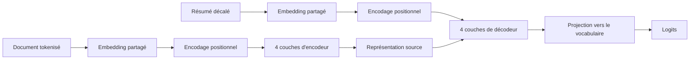
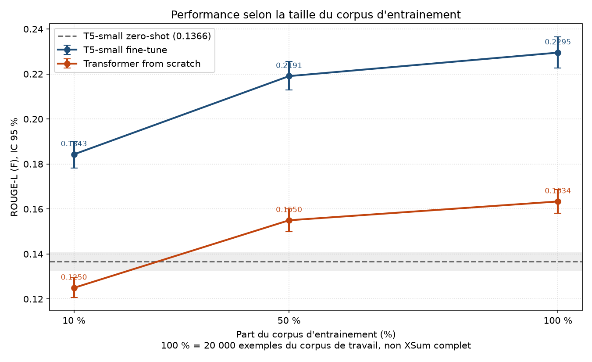

# Rapport

Ce document est le rapport scientifique du projet. Il se lit seul : chaque chiffre y est reporté, et les pages spécialisées ne sont citées que pour le détail d'implémentation.

## 1. Ce que le projet répond

L'objectif est d'entraîner un Transformer encodeur-décodeur pour le résumé automatique, puis de le comparer à un modèle pré-entraîné de référence sur les mêmes données de test.

| Exigence | Ce qui a été fait |
| --- | --- |
| Transformer encodeur-décodeur from scratch, entraîné sur un sous-ensemble | Écrit composant par composant en PyTorch, 15,6 M paramètres, entraîné sur 10 %, 50 % et 100 % du corpus |
| Modèle pré-entraîné évalué en zero-shot puis fine-tuné | `t5-small`, 60,5 M paramètres, une mesure zero-shot et trois fine-tunages |
| Ablation sur la taille du corpus, from-scratch contre pré-entraîné | Sept runs, sous-ensembles emboîtés, budget d'époques constant |
| Métrique et analyse qualitative | ROUGE-1, ROUGE-2 et ROUGE-L avec intervalles bootstrap à 95 %, plus une sélection d'exemples par run |

La campagne a été exécutée le 8 août 2026. Ce qu'elle porte est relu à chaque construction du site depuis les enregistrements de runs, et non recopié ici :

--8<-- "_generated/campaign.md"

Chaque score est mesuré sur les mêmes 1 000 documents de test. Une expérience qui échouerait, resterait partielle ou ne serait jamais lancée garderait sa ligne dans les tableaux qui suivent, avec son statut et sans score.

L'énoncé laisse le choix entre BLEU et ROUGE. ROUGE est retenu parce que la tâche est du résumé ; BLEU est absent volontairement, et aucune colonne BLEU vide ou remplie de zéros n'apparaît nulle part.

## 2. Le corpus

Le corpus de travail est un tirage figé de 22 000 exemples de **XSum**, sous graine 42 : 20 000 pour l'entraînement, 1 000 pour la validation, 1 000 pour le test. Le « 100 % » des ablations désigne ces 20 000 exemples, jamais les 204 045 de XSum complet. La convention est rappelée sur chaque figure.

L'analyse exploratoire complète est dans le notebook `notebooks/01_eda_xsum.ipynb`, orientée vers les décisions d'entraînement plutôt que vers la description. Quatre de ses résultats portent le reste du rapport.

**Le corpus est propre et étanche.** Aucun champ vide, aucun identifiant dupliqué, aucun document partagé entre l'entraînement, la validation et le test. Deux documents apparaissent deux fois dans l'entraînement et un exemple porte un résumé plus long que son document ; les trois sont conservés, parce qu'un nettoyage silencieux du corpus de référence rendrait les scores incomparables avec la littérature XSum.

**Les sous-ensembles sont emboîtés.** 10 % est un préfixe de 50 %, lui-même préfixe de 100 %, vérifié par comparaison des identifiants. Sans cet emboîtement, un écart entre deux points de la courbe mélangerait l'effet de la taille et celui de la composition de l'échantillon.

**La compression est extrême.** Le résumé médian fait 7,2 % de son document. La tâche est donc abstractive : à ce niveau, recopier ne suffit pas. C'est aussi ce qui rend un ROUGE-L de 0,23 sur XSum non comparable à un ROUGE-L publié sur CNN/DailyMail, où la référence autorise la reprise de phrases entières.

**La troncature coûte cher, et elle est assumée.** Le plafond de 512 tokens coupe 38 % des documents et ne conserve que 71 % du texte source. Passer à 1 024 tokens récupérerait 21 points de texte pour quatre fois le coût de l'encodeur, l'attention étant quadratique. Les deux familles de modèles subissent exactement la même troncature, donc la comparaison reste valide : ce qui est perdu est une part du plafond atteignable, pas l'équité.

| Plafond source | Documents coupés | Texte conservé | Coût relatif de l'encodeur |
| --- | --- | --- | --- |
| 256 | 74,3 % | 44,0 % | 0,25x |
| **512** | **38,4 %** | **70,9 %** | **1,0x** |
| 768 | 20,3 % | 84,7 % | 2,2x |
| 1 024 | 10,8 % | 92,1 % | 4,0x |
| 1 536 | 2,5 % | 97,8 % | 9,0x |

Le plafond des cibles, 64 tokens, ne coupe que 0,42 % des résumés. Il est essentiellement gratuit.

## 3. Le Transformer from scratch

### Pourquoi l'écrire

`torch.nn.Transformer` existe et fonctionne. Il n'est pas utilisé : l'objet du projet est de démontrer la compréhension de l'architecture, pas d'en consommer une implémentation. Chaque bloc est donc écrit séparément, et chaque décision de conception est vérifiée par un test qui échouerait si elle était fausse.

### L'architecture, bloc par bloc

```text
src/models/scratch/
├── config.py                 hyperparamètres validés à la construction
├── embeddings.py             table partagée, mise à l'échelle par sqrt(d_model)
├── positional_encoding.py    encodage sinusoïdal fixe
├── attention.py              softmax(Q Kt / sqrt(d_k)) V
├── multi_head_attention.py   projections, découpage en têtes, concaténation
├── feed_forward.py           réseau position par position
├── masks.py                  masque de padding, masque causal
├── encoder_layer.py          self-attention + feed forward, résiduels
├── decoder_layer.py          self-attention masquée + cross-attention + feed forward
├── encoder.py                pile d'encodeurs
├── decoder.py                pile de décodeurs + projection vers le vocabulaire
├── transformer.py            assemblage, teacher forcing, perte
└── generation.py             génération autorégressive, greedy et beam search
```

Le flux d'un exemple traverse ces blocs dans cet ordre :



### Comment le modèle est construit

La construction part de la configuration validée et n'instancie rien d'autre que ce qu'elle déclare. Trois lignes suffisent à décrire l'assemblage, et l'ordre y a un sens.

```python
self.embedding = TokenEmbedding(config.vocab_size, config.d_model,
                                padding_idx=config.pad_token_id)
self.encoder = Encoder(config, self.embedding)
self.decoder = Decoder(config, self.embedding)
```

La table d'embedding est créée en premier et **passée aux deux tours**, pas recréée dans chacune. C'est ce qui rend le partage réel plutôt que déclaratif : `encoder.embedding` et `decoder.embedding` sont le même objet en mémoire. Le décodeur va plus loin et attache sa projection de sortie à cette même matrice :

```python
self.output_projection = nn.Linear(config.d_model, config.vocab_size, bias=False)
if config.tie_embeddings:
    self.output_projection.weight = embedding.weight
```

Une vérification directe le confirme : `decoder.output_projection.weight is embedding.weight` vaut `True`, et le compte de paramètres ne compte la matrice qu'une fois, soit 15 591 424 au lieu des 23 809 024 qu'un modèle non attaché exigerait.

Chaque pile est une `nn.ModuleList` construite en compréhension, une couche par profondeur déclarée. Une couche d'encodeur instancie exactement six sous-modules : l'attention multi-têtes, le réseau position par position, deux normalisations et deux dropouts. Une couche de décodeur en instancie neuf, la self-attention masquée et la cross-attention ayant chacune leur normalisation.

L'attention multi-têtes n'instancie pas `h` petites projections mais quatre projections larges, `W_Q`, `W_K`, `W_V` et `W_O`, toutes de `d_model` vers `d_model`, initialisées en Xavier uniforme avec des biais nuls. Le découpage en têtes est une opération de forme, pas un module.

### Ce qui circule, et sous quelle forme

Les formes ci-dessous sont relevées sur un passage avant réel, avec `d_model = 256`, huit têtes et un lot de deux exemples.

| Étape | Forme | Ce qui se passe |
| --- | --- | --- |
| `source_ids` | `(2, 512)` | identifiants du document tronqué |
| masque de padding | `(2, 1, 1, 512)` | une dimension par tête et par requête, diffusée |
| sortie de l'encodeur, `memory` | `(2, 512, 256)` | un vecteur par position source |
| entrée du décodeur | `(2, 64)` | cible décalée à droite, préfixée par le token de départ |
| `logits` | `(2, 64, 32100)` | un score par token du vocabulaire, à chaque position |

À l'intérieur d'un bloc d'attention, le tenseur passe de `(2, seq, 256)` à `(2, 8, seq, 32)` par une vue et une transposition, l'attention s'applique tête par tête, puis le chemin inverse recompose `(2, seq, 256)` avant `W_O`. Les 32 dimensions par tête sont le `d_k` de la formule.

Le décalage de la cible est explicite et tient en deux lignes :

```python
shifted = target_ids.new_full(target_ids.shape, decoder_start_token_id)
shifted[:, 1:] = target_ids[:, :-1]
```

La position `t` de l'entrée décodeur porte donc le token `t - 1` de la cible, et prédire le token `t` ne demande que ce que le masque causal autorise à voir. Le tokenizer T5 n'ayant pas de token de début de séquence, l'identifiant de padding joue ce rôle, exactement comme T5 lui-même.

La perte est une entropie croisée sur les logits aplatis, avec les positions de remplissage remplacées par `-100` en amont pour être ignorées. À l'initialisation elle vaut 10,9 sur un lot aléatoire, l'ordre de grandeur attendu d'une distribution quasi uniforme sur 32 100 classes, dont le logarithme vaut 10,4. Une perte initiale très éloignée de cette valeur signalerait un câblage défectueux avant même le premier entraînement.

### L'attention

```text
Attention(Q, K, V) = softmax(Q Kt / sqrt(d_k)) V
```

`Q Kt` attribue à chaque requête un score contre chaque clé, le softmax en fait une distribution, et le produit avec `V` renvoie une moyenne pondérée des valeurs.

La division par `sqrt(d_k)` n'est pas cosmétique. Si les composantes de `Q` et `K` sont indépendantes, centrées et de variance unité, leur produit scalaire sur `d_k` dimensions a une variance de `d_k`. Quand `d_k` grandit, les scores s'étalent, le softmax sature et son gradient s'annule. La division ramène la variance à un et garde le gradient exploitable.

Les têtes travaillent en parallèle sur des sous-espaces de dimension `d_model / num_heads`, si bien que le coût total égale celui d'une tête unique de largeur `d_model`. Une seule tête ne pourrait exprimer qu'une relation à la fois.

### Les masques

Deux masques, et leur absence produirait deux résultats faux qui ressemblent à des résultats.

Le **masque de padding** empêche le modèle de lire le remplissage. Sans lui, les prédictions dépendraient de la composition du lot.

Le **masque causal** empêche la position `t` de voir les positions `> t` pendant le teacher forcing. Sans lui, le modèle lit la réponse qu'on lui demande de prédire : la perte s'effondre et la génération reste aléatoire.

Les positions interdites reçoivent la plus petite valeur finie du type, pas moins l'infini. Sur une séquence entièrement remplie de padding, moins l'infini donnerait une ligne de zéros divisée par zéro, donc des NaN.

### Pre-norm plutôt que post-norm

```text
post-norm  x = LayerNorm(x + Sublayer(x))     article original
pre-norm   x = x + Sublayer(LayerNorm(x))     défaut du projet
```

Le pre-norm laisse le chemin résiduel libre de toute normalisation, donc le gradient atteint la première couche sans distorsion. Il s'entraîne de façon fiable sans le long warmup que le post-norm réclame, ce qui compte pour un modèle entraîné from scratch sur un petit corpus. Le post-norm reste accessible par `norm_first: false`, et les deux dispositions sont couvertes par les tests.

### La configuration retenue et son coût

```yaml
d_model: 256
num_heads: 8
encoder_layers: 4
decoder_layers: 4
d_ff: 1024
dropout: 0.1
max_position: 512
tie_embeddings: true
norm_first: true
```

| Bloc | Paramètres | Part |
| --- | --- | --- |
| Table d'embedding partagée | 8 217 600 | 52,7 % |
| Décodeur, 4 couches | 4 214 272 | 27,0 % |
| Encodeur, 4 couches | 3 159 552 | 20,3 % |
| **Total** | **15 591 424** | **100 %** |

Une seule table d'embedding sert l'encodeur, le décodeur et la projection de sortie. L'attachement économise `vocab_size * d_model` paramètres et régularise un modèle entraîné sur un petit corpus, en forçant les vues d'entrée et de sortie d'un token à s'accorder.

**Ce tableau est le fait le plus important du modèle from scratch.** La table d'embedding pèse plus que l'encodeur et le décodeur réunis, et le notebook d'EDA montre ce que le corpus permet d'en apprendre : sur les 32 100 entrées du tokenizer, **23 458 apparaissent au moins une fois**, soit 73 %. Les 8 642 restantes représentent 2 212 352 paramètres, **14,2 % du modèle, qui ne reçoivent jamais le moindre gradient**. La concentration aggrave le constat : 50 % des occurrences tiennent dans 100 types, et il faut 14 510 types pour couvrir 99 % du texte. Les milliers de types les plus rares sont vus moins de dix fois, trop peu pour que leur ligne vaille mieux que son initialisation.

### Ce que les tests garantissent

Deux propriétés ne se voient pas sur une courbe de perte.

**Le décodeur ne lit pas le futur.** Modifier le token de l'entrée décodeur à la position `k` laisse les logits des positions `< k` strictement inchangés, et modifie ceux de la position `k`. La seconde moitié compte autant que la première : sans elle, un modèle qui ignorerait entièrement son entrée passerait le test.

**Le padding ne change rien.** Ajouter du remplissage à la source laisse les logits identiques. Un masque mal diffusé ferait échouer ce test alors que la perte continuerait de descendre.

S'y ajoutent la vérification de la formule d'attention sur une entrée construite à la main, l'absence de NaN sur une ligne entièrement masquée, la reproduction de l'encodage positionnel publié position par position, l'économie exacte de `vocab_size * d_model` paramètres par l'attachement, et le surapprentissage d'un lot unique jusqu'à moins de 20 % de la perte initiale.

## 4. La baseline pré-entraînée

`t5-small`, 60 506 624 paramètres, soit 3,9 fois le modèle from scratch. Elle est mesurée deux fois.

**En zero-shot**, sans aucun entraînement, avec le préfixe de tâche `summarize:` suivi d'une espace. C'est la mesure de ce que le pré-entraînement seul apporte sur cette tâche.

**Fine-tunée** sur 10 %, 50 % et 100 % du même corpus, avec le même budget d'époques et le même décodage que le modèle from scratch.

Les deux familles partagent le tokenizer `t5-small`, le corpus, le chargeur, la boucle d'entraînement, le décodage et la métrique. Le modèle zero-shot saute l'étape d'entraînement parce que ses poids ne bougent pas, pas parce qu'il emprunte un autre chemin.

Les quatre mesures sont prises sous la révision `df1b051c49625cf57a3d0d8d3863ed4d13564fe4` de `t5-small`, épinglée dans les fichiers d'expérience. Les poids fine-tunés sont les nôtres, mais l'architecture dans laquelle ils sont chargés vient du hub : sans révision fixée, elle peut changer sans que rien dans le dépôt ne change, et les chiffres cesseraient d'être reproductibles par un tiers.

## 5. Protocole d'évaluation

Le bloc d'évaluation est identique dans les neuf fichiers d'expérience :

```text
num_beams              4
max_new_tokens         64
min_new_tokens         0
no_repeat_ngram_size   3
bootstrap_samples      1000
confidence             0.95
```

Quatre règles encadrent la mesure.

**Une prédiction vide vaut zéro et reste dans la moyenne.** Retirer les documents sur lesquels un modèle a échoué relèverait sa moyenne pour avoir échoué. Le compte des prédictions vides est reporté à côté du score, ce qui sépare un score faible d'un modèle cassé. Aucun des neuf modèles n'a produit de résumé vide.

**Chaque score porte un intervalle bootstrap à 95 %**, calculé sous la graine du run. Sans lui, un écart de deux millièmes se lit comme un classement.

**Seul un run complet remplit une colonne de score.** Un run partiel garde sa ligne et son statut, et ses cellules de score restent vides.

**Des runs mesurés différemment ne sont pas mis dans un même tableau ni sur une même figure.** Le budget de décodage, la largeur de faisceau et les réglages de ROUGE voyagent dans chaque enregistrement, et l'agrégation refuse d'écrire si deux runs d'une étude divergent. Un écart entre deux modèles mesurés différemment rapporte les réglages, pas les modèles.

## 6. Courbe performance contre taille du corpus d'entraînement

C'est le livrable central du projet.



--8<-- "_generated/dataset_size.md"

Trois lectures, toutes appuyées sur des intervalles disjoints.

**L'écart entre les deux familles ne se referme pas.** Rapporté au score du modèle from scratch, le modèle pré-entraîné fait 43 % de mieux à 10 %, 39 % à 50 % et 41 % à 100 %. Les deux courbes montent en parallèle. Donner plus de données au modèle from scratch ne le rapproche pas du pré-entraîné, parce que le pré-entraîné en profite autant.

**Le pré-entraînement vaut plus que dix fois les données annotées.** `pretrained_ft_10` obtient 0,1791 sur 2 000 exemples en 218 secondes. `scratch_100` obtient 0,1634 sur 20 000 exemples en 1 761 secondes. Dix fois moins de données, huit fois moins de calcul, meilleur score.

**Le rendement est décroissant des deux côtés.** Pour le modèle from scratch, passer de 10 % à 50 % gagne 24 % en relatif, passer de 50 % à 100 % n'en gagne plus que 5 %.

## 7. À partir de quelle taille le from-scratch devient-il compétitif ?

La réponse dépend de ce à quoi on le compare, et elle est différente dans les deux cas.

### Contre le pré-entraîné fine-tuné : jamais sur la plage mesurée

Aux trois proportions, les intervalles de confiance des deux familles sont disjoints et l'écart relatif reste stable entre 39 % et 43 %. Il n'existe aucun point de croisement dans les données mesurées, et rien n'indique une convergence.

On peut chiffrer ce qu'il faudrait. Le modèle from scratch gagne 0,0129 point de ROUGE-L par doublement du corpus entre 2 000 et 10 000 exemples, et seulement 0,0084 entre 10 000 et 20 000. Combler l'écart de 0,0677 qui le sépare de `pretrained_ft_100` demanderait :

| Hypothèse de pente | Doublements nécessaires | Corpus nécessaire | Rapport à XSum complet |
| --- | --- | --- | --- |
| Pente optimiste, celle de 2 000 vers 10 000 | 5,2 | ~753 000 exemples | 3,7x |
| Pente récente, celle de 10 000 vers 20 000 | 8,1 | ~5 450 000 exemples | 26,7x |

Même l'hypothèse la plus favorable réclame **près de quatre fois la totalité de XSum**, qui compte 204 045 exemples. Et cette extrapolation est doublement optimiste : elle suppose une progression log-linéaire alors que le rendement observé décroît déjà, et surtout elle suppose que le modèle pré-entraîné resterait immobile pendant que le from-scratch le rattrape, ce qui est faux.

La raison de fond est mesurée dans le notebook d'EDA : à 10 % du corpus, le modèle from scratch dispose de **743 100 tokens source**. `t5-small` a été pré-entraîné sur de l'ordre de 34 milliards de tokens, environ 45 000 fois plus. La comparaison n'oppose pas deux modèles à données égales, elle oppose un modèle qui part de zéro à un modèle qui a déjà lu quatre ordres de grandeur de texte en plus. Aucune quantité de données annotées atteignable dans ce cadre ne comble cet écart.

### Contre le pré-entraîné zero-shot : entre 2 000 et 10 000 exemples

C'est le seul seuil de compétitivité réellement observé, et il est net.

À 2 000 exemples, le modèle from scratch obtient 0,1250 contre 0,1366 pour le zero-shot : il est derrière, et les intervalles [0,1207, 0,1293] et [0,1328, 0,1406] sont disjoints. À 10 000 exemples il obtient 0,1550, devant, et là encore les intervalles ne se recouvrent pas.

**Le croisement se situe donc entre 2 000 et 10 000 exemples annotés.** C'est une façon concrète de chiffrer ce que vaut le pré-entraînement sur cette tâche : environ le prix de quelques milliers d'exemples annotés, pas davantage, dès lors qu'on renonce à fine-tuner.

### Ce qu'il faut en retenir

Un modèle from scratch devient compétitif avec un modèle pré-entraîné **qu'on n'adapte pas**, et il le devient vite, autour de quelques milliers d'exemples. Il ne devient pas compétitif avec le même modèle pré-entraîné **fine-tuné sur les mêmes données**, et l'écart ne se referme pas à mesure que le corpus grandit. Dès qu'un modèle pré-entraîné est disponible pour la langue et la tâche visées, l'entraînement from scratch n'est pas un compromis budgétaire : c'est un choix qui coûte plus cher et rend moins.

## 8. Ablation d'architecture

Une seconde ablation fait varier la profondeur, tout le reste étant identique, corpus compris.

--8<-- "_generated/architecture.md"

**Le résultat est négatif, et il est présenté comme tel.** Le ROUGE-L décroît quand la profondeur augmente. Aucune paire n'est séparée au seuil de 95 %, tous les intervalles se recouvrent, donc aucune différence individuelle n'est établie. Ce qui reste est que trois runs indépendants classent dans le même sens, et qu'aucun gain n'apparaît là où la profondeur coûte 2,2 fois plus de calcul.

La perte de validation classe d'ailleurs différemment : elle place la profondeur 4 en tête et sature ensuite, quand le ROUGE place la profondeur 2 en tête. Ce n'est pas contradictoire. La perte mesure la prédiction du token suivant sous forçage par la référence, le ROUGE mesure un texte produit en génération autorégressive avec faisceau ; un modèle peut gagner sur la première sans gagner sur le second. C'est la justification concrète du choix de reporter le ROUGE.

**Le compte de paramètres explique le non-résultat**, et le notebook d'EDA le confirme côté corpus. La table d'embedding représente 69 % du modèle à 2 couches et 53 % du modèle à 4 couches, et 14 % du modèle entier n'est jamais mis à jour faute d'occurrences. Faire varier la profondeur ne fait donc varier qu'une minorité des paramètres, pendant que la majorité reste sous-entraînée. À `d_model` 256 et avec le vocabulaire T5, le levier n'est pas la profondeur, c'est le vocabulaire.

## 9. Analyse qualitative

Chaque run sélectionne son meilleur cas, son pire cas et un tirage aléatoire, de façon déterministe. Le tirage n'est pas un ornement : les deux extrêmes sont les deux exemples les moins représentatifs, et un modèle peut avoir un beau meilleur cas, un pire cas catastrophique et un centre plat qui est ce qu'il fait réellement.

Un même document de test, résumé par les trois modèles, montre trois comportements distincts.

> **Référence.** Three men have been arrested on suspicion of murder over the shooting of a man at a meat market.
>
> **`pretrained_ft_100`**, ROUGE-L 0,714. Three men have been arrested on suspicion of murder after a man was shot in the head and chest at a meat market.
>
> **`scratch_100`**, ROUGE-L 0,541. people have been arrested on suspicion of murder after a man was stabbed to death in a crash.
>
> **`pretrained_zero_shot`**, ROUGE-L 0,123. the 44-year-old was found badly injured at the Stanley Meat Market in the old Swan area of Liverpool on 27 January. he was shot in the head and chest and died later in hospital. the three men arrested remain in police custody for questioning.

Le zero-shot ne résume pas, il recopie : trois phrases extraites du document, là où la référence en demande une. Ses sorties font en moyenne 36,4 mots contre 21,3 pour la référence, quand tous les modèles entraînés se calent entre 17,3 et 19,4 mots. C'est la mesure de ce que le fine-tuning apprend ici : non pas la langue, que `t5-small` connaît déjà, mais le format XSum.

Le modèle from scratch a appris la forme et invente le fond. La structure de phrase est correcte et idiomatique, mais l'homme a été poignardé au lieu d'être abattu, et le lieu est devenu un accident de la route. C'est le comportement attendu d'un modèle qui a vu 20 000 exemples : il a appris à quoi ressemble un résumé XSum bien avant d'apprendre à lire le document.

Un défaut mesurable accompagne cela : le modèle from scratch commence fréquemment son résumé par un fragment de sous-mot au lieu d'un mot capitalisé, ici « people » pour « Three people ».

--8<-- "_generated/capitalisation.md"

La décroissance est régulière avec la taille du corpus, ce qui montre qu'il s'agit d'un apprentissage incomplet et non d'un défaut de code : la génération partage le même découpage de séquence pour les deux familles, et le modèle fine-tuné n'en garde qu'une trace résiduelle sur le plus petit corpus, qui disparaît ensuite. Le zero-shot est haut pour une autre raison, visible dans l'exemple ci-dessus : il recopie des phrases prises au milieu du document, donc au milieu d'une phrase. La convention typographique la plus élémentaire du corpus, une majuscule initiale, n'est apprise qu'entre 10 000 et 20 000 exemples. C'est une illustration directe du coût de partir de zéro.

## 10. Limites

**Le corpus est un tirage de 20 000 exemples, pas XSum complet.** Toutes les conclusions valent sur cette plage. L'extrapolation de la section 7 est présentée comme une extrapolation, avec ses hypothèses.

**La troncature à 512 tokens écarte 29 % du texte source.** Elle s'applique aux deux familles également, donc elle ne biaise pas la comparaison, mais elle abaisse le plafond atteignable par les deux.

**La profondeur est la seule grandeur d'architecture explorée.** La largeur `d_model` et la taille du vocabulaire, que l'analyse du corpus désigne comme le levier plus probable, n'ont pas été balayées faute de budget de calcul.

## Pour reproduire

```bash
make data                                     # corpus figé, sous graine 42
python -m src.experiments.run --all           # les neuf expériences
make ablation                                 # les tableaux
make figures                                  # les quatre figures
make report-sync                              # les tableaux de cette page
```

Les tableaux de ce rapport sont produits par la dernière commande, à partir des mêmes enregistrements que les figures. `scripts/check_docs_sync.py` échoue s'ils ne correspondent plus, de sorte qu'une nouvelle campagne ne peut pas laisser cette page énoncer les chiffres de la précédente.

Le détail de chaque étape est sur les pages [Corpus](ml/data.md), [Transformer from scratch](ml/transformer.md), [Baseline pré-entraînée](ml/baseline.md), [Évaluation](ml/evaluation.md) et [Expériences et ablations](experiments/index.md).
